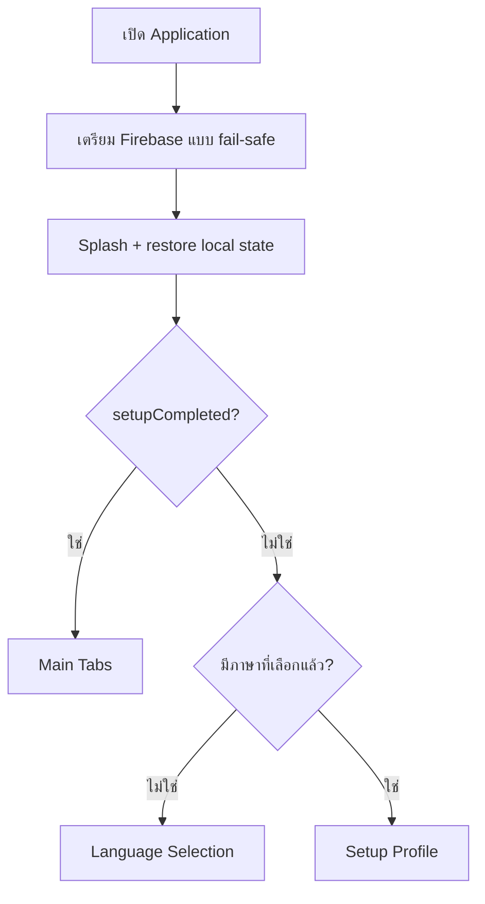
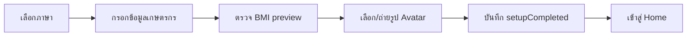
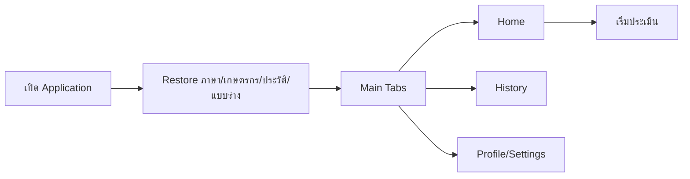
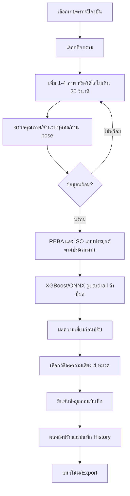

# เอกสารกระบวนการพัฒนา การทำงาน การคำนวณ และแนวทางอ้างอิง Sookta Application Version 2.1.0

## Document Control

| รายการ | ค่า |
|---|---|
| ชื่อเอกสาร | เอกสารกระบวนการพัฒนา การทำงาน การคำนวณ และแนวทางอ้างอิง |
| Release/Document Version | Sookta Application 2.1.0 |
| Source Branch | `codex/ios-real-integrations` |
| Source Commit | `08e436665db617ff4e42e26cfc914549ed7d9eb5` |
| Internal Version จาก source snapshot | `1.3.7+24` |
| วันที่จัดทำ | 28 กรกฎาคม 2026 |
| ภาษา | ภาษาไทยเป็นหลัก ใช้ภาษาอังกฤษสำหรับชื่อมาตรฐาน สูตร โมเดล และ identifier |
| กลุ่มผู้อ่าน | คณะวิจัย อาจารย์ ทีมพัฒนา และผู้ดูแลระบบ |

> **หมายเหตุเรื่องเวอร์ชัน:** ชื่อเอกสารใช้เวอร์ชัน 2.1.0 ตาม release ที่ผู้ใช้
> กำหนด ส่วน `1.3.7+24` เป็นค่า internal version ที่พบใน source snapshot
> และบันทึกไว้เพื่อให้ตรวจสอบย้อนกลับได้ เอกสารนี้ไม่ได้เปลี่ยนค่า version
> หรือ application source code

## บทสรุปผู้บริหาร

เอกสารนี้อธิบาย Sookta ตั้งแต่การรวบรวมความต้องการ การพัฒนาและประกอบ
application การเปิดใช้งานครั้งแรกและครั้งต่อไป กระบวนการประเมินความเสี่ยง
ทางการยศาสตร์ ตลอดจนสูตร เกณฑ์ โมเดล และแหล่งอ้างอิงที่เกี่ยวข้อง โดยใช้
source code, model asset, automated test และหลักฐาน UAT เป็นหลักฐานภายใน
ที่ตรวจสอบย้อนกลับได้

Sookta เป็นเครื่องมือสื่อสารความเสี่ยงทางการยศาสตร์ สนับสนุนการเรียนรู้และ
การติดตามงานวิจัย ไม่ใช่เครื่องมือวินิจฉัยโรค ใบรับรองทางการแพทย์ หรือ
หลักฐานการรับรองว่าองค์กรปฏิบัติตาม ISO 11228 ทั้งฉบับ

## 1. วัตถุประสงค์และขอบเขต

### 1.1 วัตถุประสงค์

เอกสารมีวัตถุประสงค์เพื่อทำให้คณะวิจัยและทีมพัฒนาเข้าใจระบบจากหลักฐาน
ชุดเดียวกัน โดยอธิบายสิ่งที่ผู้ใช้เห็นควบคู่กับวิธีที่ application ประมวลผล
ข้อมูลภายใน

### 1.2 ขอบเขต

ขอบเขตครอบคลุม application บน iOS และ Android, local persistence,
การประเมินจากภาพ/วิดีโอ, REBA, วิธีประยุกต์จาก ISO 11228, ผลกระทบทาง
เศรษฐกิจ, คำแนะนำ, ประวัติ, export และการคาดการณ์จากข้อมูลย้อนหลัง

### 1.3 วิธีใช้หลักฐาน

ลำดับความน่าเชื่อถือเมื่อข้อมูลขัดแย้งกันคือ source code ที่ทำงานจริง,
model asset/schema, automated test/UAT, requirement ที่อนุมัติ, เอกสารภายใน
และแหล่งอ้างอิงภายนอกตามลำดับ

คำกำกับที่ใช้ตลอดเอกสาร:

- **มาตรฐานอ้างอิง:** หลักการหรือเกณฑ์จาก primary/official source
- **การประยุกต์ของ Sookta:** สูตร เกณฑ์ หรือ calibration ที่ source เพิ่ม
- **Research template:** โครงสร้างโมเดลใช้งานได้ แต่ coefficient ยังไม่ได้
  fit จาก outcome label ของงานวิจัย
- **Deprecated:** component ที่ยังอยู่เพื่อ compatibility หรือ test แต่ไม่ใช่
  production assessment path

## 2. ภาพรวม Sookta Application

Sookta เป็น mobile application สำหรับช่วยเก็บข้อมูลภาคสนาม ประเมินและ
สื่อสารความเสี่ยงทางการยศาสตร์ของงานเกษตร และติดตามผลก่อน–หลังเลือกวิธีลด
ความเสี่ยง ผู้ใช้หลักมีสองกลุ่มที่ใช้หน้าจอชุดเดียวกัน ได้แก่ เกษตรกรหรือ
เจ้าหน้าที่ภาคสนามที่ต้องการคำอธิบายอ่านง่าย และคณะวิจัยที่ต้องการข้อมูล
มีโครงสร้างและตรวจสอบย้อนกลับได้

### 2.1 ความสามารถหลัก

- จัดการเกษตรกรหลายราย โดยเลือกผู้ที่กำลังเก็บข้อมูล เพิ่ม แก้ไข ลบ และ
  เปลี่ยนรูป avatar แยกแต่ละราย
- เลือกกิจกรรมเกษตร 6 กลุ่ม ได้แก่ ปลูกกล้า ใส่ปุ๋ย ฉีดพ่นสารกำจัดศัตรูพืช
  ตัดแต่งกิ่ง เก็บเกี่ยว และขนย้ายผลผลิต
- รับสื่อจากกล้องหรือคลังภาพจำนวน 1–4 ภาพ หรือวิดีโอไม่เกิน 20 วินาที
  ซึ่งระบบสุ่มตัวอย่างได้สูงสุด 8 frame
- ประเมินท่าทางด้วย pose estimation และ REBA ทุกกิจกรรม; เพิ่มการคำนวณ
  แบบประยุกต์จาก ISO 11228 สำหรับงานยกหรือดัน–ดึง
- แสดงคะแนน ระดับความเสี่ยง ส่วนร่างกายที่เสี่ยง เหตุผล คำแนะนำ 4 หมวด
  และผลกระทบทางเศรษฐกิจโดยประมาณ
- บันทึกผลก่อน–หลังปรับปรุง ประวัติ แบบร่าง แนวโน้มจาก 7 รายการล่าสุด และ
  export ข้อมูลสำหรับคณะวิจัย
- รองรับภาษาไทย/อังกฤษ การอ่านข้อความด้วยเสียง และ UI แนวตั้งบน iPhone
  และ Android

### 2.2 องค์ประกอบเชิงตรรกะ

| ชั้นของระบบ | หน้าที่ | ตัวอย่างหลักฐานใน source |
|---|---|---|
| Presentation | หน้าจอ onboarding, หน้าหลัก, แบบประเมิน, ผลลัพธ์, ประวัติ และ export | `lib/screens/` |
| Application state | เก็บภาษา profile เกษตรกรปัจจุบัน ประวัติ แบบร่าง และสถานะ setup | `SooktaAppState` ใน `lib/app/app_state.dart` |
| Assessment services | คำนวณ REBA, ISO แบบประยุกต์, ผลกระทบทางเศรษฐกิจ คำแนะนำ และแนวโน้ม | `lib/core/services/` |
| Media/ML | แยก frame, ตรวจจำนวนบุคคล, pose estimation และ XGBoost/ONNX guardrail | `evaluation_form_screen.dart` และ `lib/core/ergonomics_risk_prediction/` |
| Persistence/export | บันทึกข้อมูลในเครื่อง เก็บ media ให้คงอยู่ และสร้าง CSV ที่เปิดด้วย Excel ได้ | `SharedPreferences`, `LocalImageStore`, export services |
| Quality/operations | automated test, device UAT, Crashlytics และ event telemetry | `test/`, `docs/uat-*.md`, `FirebaseTelemetryService` |

### 2.3 ข้อมูลหลักและการไหลของข้อมูล

`UserProfile` ระบุตัวเกษตรกรและข้อมูลพื้นฐาน ส่วน `EvaluationDraft` เก็บ
กิจกรรม ค่าที่กรอก และ media ระหว่างทำแบบประเมิน เมื่อคำนวณแล้วระบบสร้าง
`AssessmentBreakdown` เพื่อคง input, REBA result, ISO result, frame analysis
และ motion summary ไว้ด้วยกัน หลังผู้ใช้ยืนยันวิธีลดความเสี่ยง ระบบสร้าง
`EvaluationHistoryRecord` ซึ่งเชื่อมกับ `farmerProfileId` และเก็บผลก่อน–หลัง
ไว้เป็น transaction หนึ่งรายการ

การคำนวณสำคัญทำในเครื่อง การเปิดแอปไม่ถูกบล็อกเมื่อ Firebase เริ่มต้นไม่ได้
เพราะ `main.dart` จับข้อผิดพลาดแล้วเปิด `SooktaApp` ต่อ อย่างไรก็ดี event
เชิงปฏิบัติการและ crash report จะส่งได้เมื่อ Firebase พร้อมใช้งานเท่านั้น

### 2.4 วิธีประเมินตามกิจกรรม

| กิจกรรม | `defaultJobType` | วิธีหลักที่แสดง |
|---|---|---|
| ปลูกกล้า | `reba` | REBA |
| ใส่ปุ๋ย | `lifting` | REBA + วิธีคำนวณยกของแบบประยุกต์จาก ISO 11228-1 |
| ฉีดพ่นสารกำจัดศัตรูพืช | `pushPull` | REBA + วิธีคำนวณดัน–ดึงแบบประยุกต์จาก ISO 11228-2 |
| ตัดแต่งกิ่ง | `reba` | REBA |
| เก็บเกี่ยว | `reba` | REBA |
| ขนย้ายผลผลิต | `lifting` | REBA + วิธีคำนวณยกของแบบประยุกต์จาก ISO 11228-1 |

ผู้ใช้ยังตรวจและเปลี่ยนค่าประเภทงานหรือค่าภาระงานที่หน้าประเมินได้ ตารางนี้
จึงเป็นค่าเริ่มต้นของ application ไม่ใช่ข้อสรุปว่างานจริงทุกกรณีมีลักษณะ
เหมือนกัน

## 3. Flow การสร้าง Application

Flow นี้สรุปกระบวนการที่ใช้ประกอบ Sookta ตั้งแต่ความต้องการจนเป็น release
artifact ที่ส่ง Store ได้ โดยแต่ละช่วงมีหลักฐานหรือจุดตรวจ (gate) ก่อนเข้าสู่
ช่วงถัดไป

```mermaid
flowchart LR
  A[Requirement และ guideline] --> B[UX/UI และ data flow]
  B --> C[Flutter implementation]
  C --> D[Media, assessment และ ML integration]
  D --> E[Persistence, history และ export]
  E --> F[Automated tests]
  F --> G[UAT บน iPhone จริง]
  G --> H[Android parity/UAT]
  H --> I[Production configuration]
  I --> J[Signed IPA/AAB และ Store validation]
```

<!-- DOCX_DIAGRAM:development-lifecycle -->

### 3.1 Requirement และเกณฑ์ยอมรับ

1. รวบรวม use case ภาคสนาม กลุ่มผู้ใช้ กิจกรรม ข้อมูลที่ต้องเก็บ รูปแบบ
   คำแนะนำ ภาษา การอ่านออกเสียง และไฟล์ export
2. แยก requirement ที่ผู้ใช้มองเห็นออกจากสูตร มาตรฐาน และข้อจำกัดทางเทคนิค
3. กำหนด acceptance criteria ที่ทดสอบได้ เช่น การเพิ่มเกษตรกรคนที่สองต้อง
   เปลี่ยน avatar ได้ คำแนะนำต้องแบ่ง 4 การ์ด และ flow production ต้องไม่
   ข้ามเงื่อนไขความพร้อมของสื่อ
4. บันทึก requirement ที่อนุมัติเป็น baseline และเชื่อมกับ test/UAT

**Gate:** requirement สำคัญมีผลลัพธ์ที่สังเกตได้ มี owner และมีวิธีตรวจ
ผ่าน/ไม่ผ่าน

### 3.2 UX/UI และ application architecture

1. ออกแบบ navigation แยก onboarding กับ main tabs และแยก first run/
   returning user
2. ออกแบบภาษาที่เหมาะกับผู้ใช้ภาคสนาม เช่น คะแนนอ่านง่าย เหตุผลแยกส่วน
   ร่างกาย และคำแนะนำเป็นหมวดสั้น
3. กำหนด data model ให้ profile, draft, assessment และ history เชื่อมด้วย
   identifier ที่ตรวจสอบย้อนกลับได้
4. กำหนด service boundary ให้ UI เรียก calculation, media, model และ export
   ผ่านส่วนรับผิดชอบที่แยกจากกัน

**Gate:** route, state transition, input/output และ failure state ครบก่อน
เริ่มพัฒนาหน้าจอปลายทาง

### 3.3 Flutter implementation และการประกอบระบบ

1. พัฒนา theme, responsive component, navigation และ local state
2. พัฒนา onboarding, จัดการเกษตรกร, แบบประเมิน, ผลลัพธ์, ประวัติ, guideline,
   help และ export
3. เชื่อม camera/gallery, video frame extraction, pose estimation และ
   model inference
4. เชื่อม REBA, สูตรประยุกต์จาก ISO, economic impact, recommendation และ
   daily trend
5. เพิ่ม persistence พร้อม schema migration/backup และ rollback เมื่อ
   บันทึก transaction ไม่สำเร็จ
6. เพิ่ม Firebase Analytics/Crashlytics โดยให้แอปทำงานต่อได้เมื่อบริการ
   telemetry ไม่พร้อม

**Gate:** production path ทำงานตั้งแต่เปิดแอปจนบันทึกประวัติ โดยไม่มี
temporary bypass และไม่มี dependency บน test fixture

### 3.4 Verification และ UAT

1. รัน static analysis และ automated test ทุกกลุ่ม
2. ตรวจสูตรด้วย unit test และตรวจ workflow/widget ด้วย test ที่ยืนยัน
   navigation, validation, grouping และ persistence
3. ทดสอบบน iPhone จริงก่อนตามลำดับโครงการ: permission, camera/gallery,
   video, Thai TTS, portrait lock, multi-farmer, assessment และ save/export
4. เมื่อ iPhone ผ่านครบ จึงตรวจ Android ให้ UI, spacing, wording และผลคำนวณ
   เทียบเท่า iOS พร้อมตรวจ permission และ native video channel
5. บันทึกผล UAT และ regression ที่พบ แล้วแก้ไขและทดสอบซ้ำเฉพาะจุดรวมทั้ง
   full suite

**Gate:** automated test ผ่าน และ critical flow ผ่านบนอุปกรณ์จริงทั้ง
platform ที่จะออก release โดย defect ระดับบล็อกถูกปิดแล้ว

### 3.5 Production configuration และ Store artifact

1. ปิด temporary bypass/debug route จาก user-facing production flow
2. lock orientation เป็นแนวตั้งและตรวจ platform metadata
3. กำหนด release version/build, bundle/application identifier, signing และ
   production service configuration
4. สร้าง signed `.ipa` สำหรับ App Store Connect และ signed `.aab` สำหรับ
   Google Play Console
5. ตรวจ metadata ภายใน artifact หลัง build ไม่ใช้เพียงค่าที่หน้า project
6. ส่งผ่าน Store validation และแก้ version train/orientation rule หาก
   platform ปฏิเสธ

**ข้อควรระวังเรื่องเวอร์ชัน:** release/document version 2.1.0 ในเอกสารนี้
เป็นชื่อรุ่นที่กำหนดสำหรับ Store ส่วน source snapshot ที่ตรวจพบยังบันทึก
`1.3.7+24` ภายใน `pubspec.yaml`; ก่อนสร้าง artifact จริงต้องทำให้ค่า version
ภายใน artifact สอดคล้องกับ release train ที่เปิดรับบน Store

## 4. Workflow การทำงานของ Application

### 4.1 Startup decision

เมื่อเริ่มทำงาน `main.dart` เตรียม Flutter binding และพยายามเริ่ม Firebase
ก่อนสร้าง `SooktaApp` จากนั้นหน้า Splash เรียก `SooktaAppState.restore()`
ควบคู่กับเวลาแสดงโลโก้อย่างน้อยประมาณ 900 มิลลิวินาที เมื่อ state พร้อมจึง
เลือก route ถัดไป

<!-- DOCX_DIAGRAM:startup-decision -->

ใน build ที่กำหนด compile-time `SOOKTA_CAPTURE_ROUTE` ระบบสามารถเข้าสู่
route สำหรับเก็บหลักฐานภาพวิจัยได้โดยตรง นี่เป็น diagnostic/research
configuration ไม่ใช่เส้นทางปกติที่ผู้ใช้ production เลือกจาก UI

### 4.2 การเปิดใช้งานครั้งแรก

<!-- DOCX_DIAGRAM:first-run -->

1. ผู้ใช้เลือกภาษาไทยหรืออังกฤษ ระบบบันทึก `AppLanguage`
2. หน้า Setup เก็บ participant/farmer code, ชื่อ, บทบาท, พื้นที่, อายุ,
   เพศ, น้ำหนัก, ส่วนสูง และรายได้ต่อปี โดยสามารถสร้าง participant code
   แบบสุ่มได้
3. ระบบแสดง BMI preview จากน้ำหนักและส่วนสูงที่กรอก แต่ไม่ใช้ BMI เป็น
   การวินิจฉัย
4. ผู้ใช้เลือกรูป avatar ที่มากับแอป ถ่ายภาพ หรือเลือกภาพจากเครื่อง
5. `saveAvatarAndFinish()` บันทึก profile, ตั้ง `setupCompleted = true`
   และเปลี่ยน route ไป Main Tabs โดยล้าง onboarding route ออกจาก stack

หากผู้ใช้เลือกภาษาแล้วแต่ปิดแอปก่อนจบ setup ครั้งถัดไประบบจะกลับเข้า Setup
โดยไม่บังคับเลือกภาษาใหม่

### 4.3 การเปิดใช้งานครั้งต่อไป

<!-- DOCX_DIAGRAM:returning-user -->

ระบบคืนค่า language, farmer list, active farmer, history, draft และลำดับ
transaction จาก local storage หาก active farmer เดิมหาไม่พบ ระบบใช้เกษตรกร
รายแรกแทน Home แสดงเกษตรกรที่กำลังเก็บข้อมูล สรุปผลล่าสุด และทางเข้าเริ่ม
ประเมิน ส่วน History แสดงรายการเดิม และ Profile เป็นทางเข้าจัดการข้อมูล
ภาษา help/reference แนวโน้ม และ export

หาก restore พบข้อมูลเสียหายจน parse ไม่ได้ `SooktaAppState` จะกลับสู่ state
เริ่มต้นที่ปลอดภัยแทนการคง object บางส่วนที่ไม่สอดคล้องกัน การทำเช่นนี้ช่วย
ให้แอปเปิดได้ แต่ข้อมูลที่เสียหายอาจไม่ปรากฏและต้องใช้หลักฐาน backup/schema
migration ในการวิเคราะห์ภายหลัง

### 4.4 Workflow การประเมินแบบ end-to-end

<!-- DOCX_DIAGRAM:assessment-e2e -->

1. **เลือกเกษตรกร:** Home ระบุ active farmer อย่างชัดเจน ผู้ใช้ต้องสลับหรือ
   เพิ่มรายชื่อก่อนเริ่ม เพื่อให้ history/export เชื่อมกับบุคคลถูกต้อง
2. **เลือกกิจกรรม:** หน้าเลือกประเภทงานแสดง 6 กิจกรรมและแบบร่างสูงสุด 3
   รายการล่าสุดของเกษตรกรปัจจุบัน ผู้ใช้เปิดต่อหรือลบแบบร่างได้
3. **รับ media:** ใช้ภาพ 1–4 ภาพ หรือวิดีโอไม่เกิน 20 วินาที วิดีโอถูก
   แยกเป็น frame สูงสุด 8 จุดพร้อม timestamp; ไม่ใช่การให้คะแนนทุก frame
   แบบต่อเนื่อง
4. **ตรวจความพร้อม:** ระบบบล็อกปุ่มวิเคราะห์เมื่อไม่มี media, pose ยังอ่าน
   ไม่สำเร็จ, กำลังประมวลผล, คุณภาพ/มุมภาพไม่ผ่าน หรือค่าบังคับไม่สมเหตุผล
   เช่น ชั่วโมงทำงานไม่มากกว่า 0
5. **อ่านท่าทาง:** pose service ประเมิน landmark และมุมร่างกาย ระบบตรวจ
   หลายบุคคลและสรุป frame ที่เสี่ยงที่สุด/motion summary สำหรับวิดีโอ
6. **คำนวณ:** ทุกงานคำนวณ REBA งานยกคำนวณ lifting ratio และงานดัน–ดึง
   คำนวณ force ratio เพิ่ม จากนั้นใช้ความเสี่ยงสูงกว่าระหว่าง REBA กับ ISO
   result เป็น combined result
7. **ML guardrail:** เมื่อ XGBoost/ONNX posture alert พร้อม ระบบใช้ผลเป็น
   guardrail ที่อาจยกระดับการสื่อสารความเสี่ยง แต่ไม่ลดผลจากสูตรหลัก
8. **แสดงผลก่อนปรับ:** แสดงคะแนน ระดับความเสี่ยง จุดเสี่ยง เหตุผล ผลกระทบ
   ทางเศรษฐกิจ และวิธีลดความเสี่ยง
9. **เลือกวิธีลดความเสี่ยง:** ตัวเลือกแบ่งเป็น 4 การ์ด ได้แก่ การปรับท่าทาง
   วิธีลดความเสี่ยง การพัก/สลับงาน และการช่วยลดภาระงาน
10. **ยืนยันก่อนบันทึก:** ผู้ใช้ตรวจเกษตรกร กิจกรรม และข้อมูลสำคัญ ทำ
    pre-save confirmation แล้วจึงเปิดผลหลังปรับปรุงได้ Production flow
    ไม่มีการ bypass ขั้นนี้
11. **บันทึก transaction:** หน้า Final Result เรียก `saveEvaluation()` เพียง
    ครั้งเดียว เพิ่ม record ไว้ต้น history ลบ draft ที่เกี่ยวข้อง และ
    rollback history/draft/เลขลำดับหาก persistence ล้มเหลว
12. **ติดตามต่อ:** เมื่อจำนวน record ของเกษตรกรครบ 7, 14, 21... ระบบประเมิน
    trend จากข้อมูลล่าสุดและอาจแจ้งให้ดูแนวโน้ม ส่วน export ใช้ส่งข้อมูล
    structured CSV ให้คณะวิจัย

### 4.5 Multi-farmer และ draft isolation

เกษตรกรแต่ละรายมี `profileId` ภายในแยกจาก participant/farmer code ที่ผู้ใช้
กรอก `activeProfileId` กำหนดเจ้าของ assessment ใหม่ และ history ถูกกรองด้วย
`farmerProfileId` แบบร่างมี key ที่ประกอบด้วย profile/activity/date จึงเปิด
งานค้างของรายหนึ่งโดยไม่ปะปนกับอีกราย เมื่อเพิ่มเกษตรกรใหม่ รายใหม่นั้นจะ
กลายเป็น active farmer ทันทีและสามารถเลือกรูป avatar ของตนได้

### 4.6 State recovery และเส้นทางย้อนกลับ

- การเปลี่ยนกิจกรรมจากหน้าผลก่อนปรับจะแจ้งว่า input ถูกเก็บเป็นแบบร่าง
  ผู้ใช้กลับมาเปิดต่อจากหน้าเลือกกิจกรรมได้
- media ถูกคัดลอกผ่าน `LocalImageStore` ก่อนบันทึก draft เพื่อไม่ให้ path
  ชั่วคราวจาก image picker สูญหาย
- route ที่ต้องใช้ payload เช่น Initial Risk และ Final Result จะแสดง
  `RouteErrorScreen` หาก argument ไม่ถูกชนิด แทนการสร้างผลลัพธ์สมมติ
- การบันทึก final result มี guard ป้องกันการบันทึกซ้ำจาก lifecycle ของหน้า
  และคืน state เดิมหากเขียน local storage ไม่สำเร็จ

## 5. วิธีการคำนวณทั้งหมด

ส่วนนี้รวบรวม input สูตร หน่วย threshold output ตัวอย่าง ข้อจำกัด และ
source mapping ของการคำนวณทุกกลุ่ม

## 6. Guideline และการอ้างอิง

ส่วนนี้เชื่อมโยง REBA, ISO 11228, ILO, MoveNet, Logistic Regression,
XGBoost/ONNX กับ implementation จริงโดยไม่กล่าวอ้างเกินหลักฐาน

## 7. การจัดเก็บข้อมูลและความเป็นส่วนตัว

ส่วนนี้อธิบายข้อมูลที่เก็บในเครื่อง การกู้คืน state การ export และ telemetry
ที่เกี่ยวข้อง

## 8. การทดสอบและหลักฐานตรวจสอบ

ส่วนนี้เชื่อมโยง requirement กับ automated test, UAT และ platform
configuration

## 9. ข้อจำกัด

ส่วนนี้อธิบายข้อจำกัดของภาพสองมิติ ข้อมูลที่ผู้ใช้กรอก สมมติฐานทางเศรษฐกิจ
และสถานะการฝึกโมเดล

## ภาคผนวก A คำศัพท์

ภาคผนวกนี้รวบรวมคำศัพท์ไทย/อังกฤษที่ใช้ในเอกสาร

## ภาคผนวก B ตารางตัวแปร

ภาคผนวกนี้รวบรวมสัญลักษณ์ หน่วย ช่วงค่า และแหล่งที่มาของตัวแปร

## ภาคผนวก C Source Mapping

ภาคผนวกนี้เชื่อมโยงหัวข้อกับ file, class, method และ test

## เอกสารอ้างอิง

รายการอ้างอิงใช้รูปแบบ APA 7 และ URL ไปยัง primary/official source
