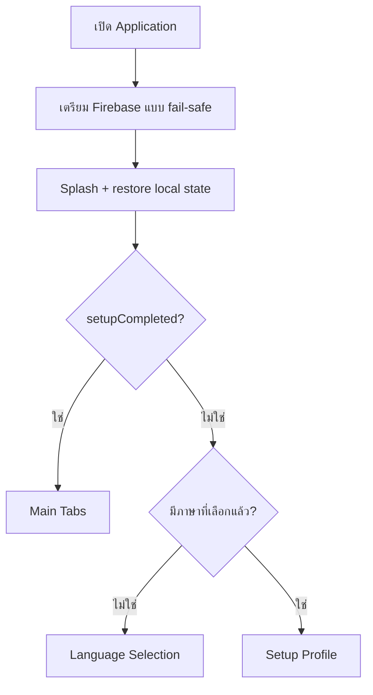
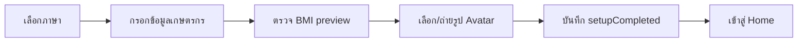
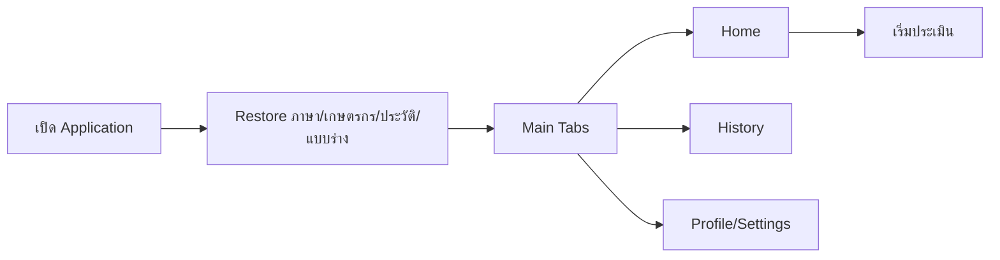
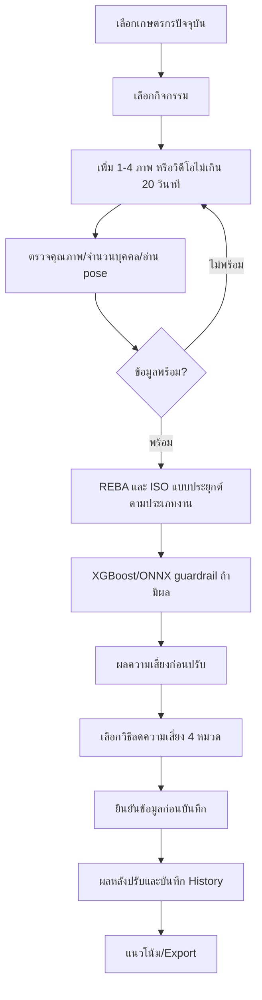

# เอกสารกระบวนการพัฒนา การทำงาน การคำนวณ และแนวทางอ้างอิง Sookta Application Version 2.1.0

## Document Control

| รายการ | ค่า |
|---|---|
| ชื่อเอกสาร | เอกสารกระบวนการพัฒนา การทำงาน การคำนวณ และแนวทางอ้างอิง |
| Release/Document Version | Sookta Application 2.1.0 |
| Source Branch | `codex/ios-real-integrations` |
| Source Commit | `08e436665db617ff4e42e26cfc914549ed7d9eb5` |
| Internal Version จาก source snapshot | `1.3.7+24` |
| วันที่จัดทำ | 28 กรกฎาคม 2026 |
| ภาษา | ภาษาไทยเป็นหลัก ใช้ภาษาอังกฤษสำหรับชื่อมาตรฐาน สูตร โมเดล และ identifier |

> **หมายเหตุเรื่องเวอร์ชัน:** ชื่อเอกสารใช้เวอร์ชัน 2.1.0 ตาม release ที่ผู้ใช้
> กำหนด ส่วน `1.3.7+24` เป็นค่า internal version ที่พบใน source snapshot
> และบันทึกไว้เพื่อให้ตรวจสอบย้อนกลับได้ เอกสารนี้ไม่ได้เปลี่ยนค่า version
> หรือ application source code

## สรุปภาพรวม

เอกสารนี้อธิบาย Sookta ตั้งแต่การรวบรวมความต้องการ การพัฒนาและประกอบ
application การเปิดใช้งานครั้งแรกและครั้งต่อไป กระบวนการประเมินความเสี่ยง
ทางการยศาสตร์ ตลอดจนสูตร เกณฑ์ โมเดล และแหล่งอ้างอิงที่เกี่ยวข้อง โดยใช้
source code, model asset, automated test และหลักฐาน UAT เป็นหลักฐานภายใน
ที่ตรวจสอบย้อนกลับได้

Sookta เป็นเครื่องมือสื่อสารความเสี่ยงทางการยศาสตร์ สนับสนุนการเรียนรู้และ
การติดตามงานวิจัย ไม่ใช่เครื่องมือวินิจฉัยโรค ใบรับรองทางการแพทย์ หรือ
หลักฐานการรับรองว่าองค์กรปฏิบัติตาม ISO 11228 ทั้งฉบับ

## 1. วัตถุประสงค์และขอบเขต

### 1.1 วัตถุประสงค์

เอกสารมีวัตถุประสงค์เพื่ออธิบายระบบจากหลักฐานชุดเดียวกัน โดยเชื่อมโยง
สิ่งที่ผู้ใช้เห็นกับวิธีที่ application ประมวลผลข้อมูลภายใน และทำให้
ตรวจสอบย้อนกลับถึง source code, test และแหล่งอ้างอิงได้

### 1.2 ขอบเขต

ขอบเขตครอบคลุม application บน iOS และ Android, local persistence,
การประเมินจากภาพ/วิดีโอ, REBA, วิธีประยุกต์จาก ISO 11228, ผลกระทบทาง
เศรษฐกิจ, คำแนะนำ, ประวัติ, export และการคาดการณ์จากข้อมูลย้อนหลัง

### 1.3 วิธีใช้หลักฐาน

ลำดับความน่าเชื่อถือเมื่อข้อมูลขัดแย้งกันคือ source code ที่ทำงานจริง,
model asset/schema, automated test/UAT, requirement ที่อนุมัติ, เอกสารภายใน
และแหล่งอ้างอิงภายนอกตามลำดับ

คำกำกับที่ใช้ตลอดเอกสาร:

- **มาตรฐานอ้างอิง:** หลักการหรือเกณฑ์จาก primary/official source
- **การประยุกต์ของ Sookta:** สูตร เกณฑ์ หรือ calibration ที่ source เพิ่ม
- **Research template:** โครงสร้างโมเดลใช้งานได้ แต่ coefficient ยังไม่ได้
  fit จาก outcome label ของงานวิจัย
- **Deprecated:** component ที่ยังอยู่เพื่อ compatibility หรือ test แต่ไม่ใช่
  production assessment path

## 2. ภาพรวม Sookta Application

Sookta เป็น mobile application สำหรับช่วยเก็บข้อมูลภาคสนาม ประเมินและ
สื่อสารความเสี่ยงทางการยศาสตร์ของงานเกษตร และติดตามผลก่อน–หลังเลือกวิธีลด
ความเสี่ยง ผู้ใช้หลักมีสองกลุ่มที่ใช้หน้าจอชุดเดียวกัน ได้แก่ เกษตรกรหรือ
เจ้าหน้าที่ภาคสนามที่ต้องการคำอธิบายอ่านง่าย และคณะวิจัยที่ต้องการข้อมูล
มีโครงสร้างและตรวจสอบย้อนกลับได้

### 2.1 ความสามารถหลัก

- จัดการเกษตรกรหลายราย โดยเลือกผู้ที่กำลังเก็บข้อมูล เพิ่ม แก้ไข ลบ และ
  เปลี่ยนรูป avatar แยกแต่ละราย
- เลือกกิจกรรมเกษตร 6 กลุ่ม ได้แก่ ปลูกกล้า ใส่ปุ๋ย ฉีดพ่นสารกำจัดศัตรูพืช
  ตัดแต่งกิ่ง เก็บเกี่ยว และขนย้ายผลผลิต
- รับสื่อจากกล้องหรือคลังภาพจำนวน 1–4 ภาพ หรือวิดีโอไม่เกิน 20 วินาที
  ซึ่งระบบสุ่มตัวอย่างได้สูงสุด 8 frame
- ประเมินท่าทางด้วย pose estimation และ REBA ทุกกิจกรรม; เพิ่มการคำนวณ
  แบบประยุกต์จาก ISO 11228 สำหรับงานยกหรือดัน–ดึง
- แสดงคะแนน ระดับความเสี่ยง ส่วนร่างกายที่เสี่ยง เหตุผล คำแนะนำ 4 หมวด
  และผลกระทบทางเศรษฐกิจโดยประมาณ
- บันทึกผลก่อน–หลังปรับปรุง ประวัติ แบบร่าง แนวโน้มจาก 7 รายการล่าสุด และ
  export ข้อมูลสำหรับคณะวิจัย
- รองรับภาษาไทย/อังกฤษ การอ่านข้อความด้วยเสียง และ UI แนวตั้งบน iPhone
  และ Android

### 2.2 องค์ประกอบเชิงตรรกะ

| ชั้นของระบบ | หน้าที่ | ตัวอย่างหลักฐานใน source |
|---|---|---|
| Presentation | หน้าจอ onboarding, หน้าหลัก, แบบประเมิน, ผลลัพธ์, ประวัติ และ export | `lib/screens/` |
| Application state | เก็บภาษา profile เกษตรกรปัจจุบัน ประวัติ แบบร่าง และสถานะ setup | `SooktaAppState` ใน `lib/app/app_state.dart` |
| Assessment services | คำนวณ REBA, ISO แบบประยุกต์, ผลกระทบทางเศรษฐกิจ คำแนะนำ และแนวโน้ม | `lib/core/services/` |
| Media/ML | แยก frame, ตรวจจำนวนบุคคล, pose estimation และ XGBoost/ONNX guardrail | `evaluation_form_screen.dart` และ `lib/core/ergonomics_risk_prediction/` |
| Persistence/export | บันทึกข้อมูลในเครื่อง เก็บ media ให้คงอยู่ และสร้าง CSV ที่เปิดด้วย Excel ได้ | `SharedPreferences`, `LocalImageStore`, export services |
| Quality/operations | automated test, device UAT, Crashlytics และ event telemetry | `test/`, `docs/uat-*.md`, `FirebaseTelemetryService` |

### 2.3 ข้อมูลหลักและการไหลของข้อมูล

`UserProfile` ระบุตัวเกษตรกรและข้อมูลพื้นฐาน ส่วน `EvaluationDraft` เก็บ
กิจกรรม ค่าที่กรอก และ media ระหว่างทำแบบประเมิน เมื่อคำนวณแล้วระบบสร้าง
`AssessmentBreakdown` เพื่อคง input, REBA result, ISO result, frame analysis
และ motion summary ไว้ด้วยกัน หลังผู้ใช้ยืนยันวิธีลดความเสี่ยง ระบบสร้าง
`EvaluationHistoryRecord` ซึ่งเชื่อมกับ `farmerProfileId` และเก็บผลก่อน–หลัง
ไว้เป็น transaction หนึ่งรายการ

การคำนวณสำคัญทำในเครื่อง การเปิดแอปไม่ถูกบล็อกเมื่อ Firebase เริ่มต้นไม่ได้
เพราะ `main.dart` จับข้อผิดพลาดแล้วเปิด `SooktaApp` ต่อ อย่างไรก็ดี event
เชิงปฏิบัติการและ crash report จะส่งได้เมื่อ Firebase พร้อมใช้งานเท่านั้น

### 2.4 วิธีประเมินตามกิจกรรม

| กิจกรรม | `defaultJobType` | วิธีหลักที่แสดง |
|---|---|---|
| ปลูกกล้า | `reba` | REBA |
| ใส่ปุ๋ย | `lifting` | REBA + วิธีคำนวณยกของแบบประยุกต์จาก ISO 11228-1 |
| ฉีดพ่นสารกำจัดศัตรูพืช | `pushPull` | REBA + วิธีคำนวณดัน–ดึงแบบประยุกต์จาก ISO 11228-2 |
| ตัดแต่งกิ่ง | `reba` | REBA |
| เก็บเกี่ยว | `reba` | REBA |
| ขนย้ายผลผลิต | `lifting` | REBA + วิธีคำนวณยกของแบบประยุกต์จาก ISO 11228-1 |

ผู้ใช้ยังตรวจและเปลี่ยนค่าประเภทงานหรือค่าภาระงานที่หน้าประเมินได้ ตารางนี้
จึงเป็นค่าเริ่มต้นของ application ไม่ใช่ข้อสรุปว่างานจริงทุกกรณีมีลักษณะ
เหมือนกัน

## 3. Flow การสร้าง Application

Flow นี้สรุปกระบวนการที่ใช้ประกอบ Sookta ตั้งแต่ความต้องการจนเป็น release
artifact ที่ส่ง Store ได้ โดยแต่ละช่วงมีหลักฐานหรือจุดตรวจ (gate) ก่อนเข้าสู่
ช่วงถัดไป

```mermaid
flowchart LR
  A[Requirement และ guideline] --> B[UX/UI และ data flow]
  B --> C[Flutter implementation]
  C --> D[Media, assessment และ ML integration]
  D --> E[Persistence, history และ export]
  E --> F[Automated tests]
  F --> G[UAT บน iPhone จริง]
  G --> H[Android parity/UAT]
  H --> I[Production configuration]
  I --> J[Signed IPA/AAB และ Store validation]
```

<!-- DOCX_DIAGRAM:development-lifecycle -->



### 3.1 Requirement และเกณฑ์ยอมรับ

1. รวบรวม use case ภาคสนาม กลุ่มผู้ใช้ กิจกรรม ข้อมูลที่ต้องเก็บ รูปแบบ
   คำแนะนำ ภาษา การอ่านออกเสียง และไฟล์ export
2. แยก requirement ที่ผู้ใช้มองเห็นออกจากสูตร มาตรฐาน และข้อจำกัดทางเทคนิค
3. กำหนด acceptance criteria ที่ทดสอบได้ เช่น การเพิ่มเกษตรกรคนที่สองต้อง
   เปลี่ยน avatar ได้ คำแนะนำต้องแบ่ง 4 การ์ด และ flow production ต้องไม่
   ข้ามเงื่อนไขความพร้อมของสื่อ
4. บันทึก requirement ที่อนุมัติเป็น baseline และเชื่อมกับ test/UAT

**Gate:** requirement สำคัญมีผลลัพธ์ที่สังเกตได้ มี owner และมีวิธีตรวจ
ผ่าน/ไม่ผ่าน

### 3.2 UX/UI และ application architecture

1. ออกแบบ navigation แยก onboarding กับ main tabs และแยก first run/
   returning user
2. ออกแบบภาษาที่เหมาะกับผู้ใช้ภาคสนาม เช่น คะแนนอ่านง่าย เหตุผลแยกส่วน
   ร่างกาย และคำแนะนำเป็นหมวดสั้น
3. กำหนด data model ให้ profile, draft, assessment และ history เชื่อมด้วย
   identifier ที่ตรวจสอบย้อนกลับได้
4. กำหนด service boundary ให้ UI เรียก calculation, media, model และ export
   ผ่านส่วนรับผิดชอบที่แยกจากกัน

**Gate:** route, state transition, input/output และ failure state ครบก่อน
เริ่มพัฒนาหน้าจอปลายทาง

### 3.3 Flutter implementation และการประกอบระบบ

1. พัฒนา theme, responsive component, navigation และ local state
2. พัฒนา onboarding, จัดการเกษตรกร, แบบประเมิน, ผลลัพธ์, ประวัติ, guideline,
   help และ export
3. เชื่อม camera/gallery, video frame extraction, pose estimation และ
   model inference
4. เชื่อม REBA, สูตรประยุกต์จาก ISO, economic impact, recommendation และ
   daily trend
5. เพิ่ม persistence พร้อม schema migration/backup และ rollback เมื่อ
   บันทึก transaction ไม่สำเร็จ
6. เพิ่ม Firebase Analytics/Crashlytics โดยให้แอปทำงานต่อได้เมื่อบริการ
   telemetry ไม่พร้อม

**Gate:** production path ทำงานตั้งแต่เปิดแอปจนบันทึกประวัติ โดยไม่มี
temporary bypass และไม่มี dependency บน test fixture

### 3.4 Verification และ UAT

1. รัน static analysis และ automated test ทุกกลุ่ม
2. ตรวจสูตรด้วย unit test และตรวจ workflow/widget ด้วย test ที่ยืนยัน
   navigation, validation, grouping และ persistence
3. ทดสอบบน iPhone จริงก่อนตามลำดับโครงการ: permission, camera/gallery,
   video, Thai TTS, portrait lock, multi-farmer, assessment และ save/export
4. เมื่อ iPhone ผ่านครบ จึงตรวจ Android ให้ UI, spacing, wording และผลคำนวณ
   เทียบเท่า iOS พร้อมตรวจ permission และ native video channel
5. บันทึกผล UAT และ regression ที่พบ แล้วแก้ไขและทดสอบซ้ำเฉพาะจุดรวมทั้ง
   full suite

**Gate:** automated test ผ่าน และ critical flow ผ่านบนอุปกรณ์จริงทั้ง
platform ที่จะออก release โดย defect ระดับบล็อกถูกปิดแล้ว

### 3.5 Production configuration และ Store artifact

1. ปิด temporary bypass/debug route จาก user-facing production flow
2. lock orientation เป็นแนวตั้งและตรวจ platform metadata
3. กำหนด release version/build, bundle/application identifier, signing และ
   production service configuration
4. สร้าง signed `.ipa` สำหรับ App Store Connect และ signed `.aab` สำหรับ
   Google Play Console
5. ตรวจ metadata ภายใน artifact หลัง build ไม่ใช้เพียงค่าที่หน้า project
6. ส่งผ่าน Store validation และแก้ version train/orientation rule หาก
   platform ปฏิเสธ

**ข้อควรระวังเรื่องเวอร์ชัน:** release/document version 2.1.0 ในเอกสารนี้
เป็นชื่อรุ่นที่กำหนดสำหรับ Store ส่วน source snapshot ที่ตรวจพบยังบันทึก
`1.3.7+24` ภายใน `pubspec.yaml`; ก่อนสร้าง artifact จริงต้องทำให้ค่า version
ภายใน artifact สอดคล้องกับ release train ที่เปิดรับบน Store

## 4. Workflow การทำงานของ Application

### 4.1 Startup decision

เมื่อเริ่มทำงาน `main.dart` เตรียม Flutter binding และพยายามเริ่ม Firebase
ก่อนสร้าง `SooktaApp` จากนั้นหน้า Splash เรียก `SooktaAppState.restore()`
ควบคู่กับเวลาแสดงโลโก้อย่างน้อยประมาณ 900 มิลลิวินาที เมื่อ state พร้อมจึง
เลือก route ถัดไป

<!-- DOCX_DIAGRAM:startup-decision -->



ใน build ที่กำหนด compile-time `SOOKTA_CAPTURE_ROUTE` ระบบสามารถเข้าสู่
route สำหรับเก็บหลักฐานภาพวิจัยได้โดยตรง นี่เป็น diagnostic/research
configuration ไม่ใช่เส้นทางปกติที่ผู้ใช้ production เลือกจาก UI

### 4.2 การเปิดใช้งานครั้งแรก

<!-- DOCX_DIAGRAM:first-run -->



1. ผู้ใช้เลือกภาษาไทยหรืออังกฤษ ระบบบันทึก `AppLanguage`
2. หน้า Setup เก็บ participant/farmer code, ชื่อ, บทบาท, พื้นที่, อายุ,
   เพศ, น้ำหนัก, ส่วนสูง และรายได้ต่อปี โดยสามารถสร้าง participant code
   แบบสุ่มได้
3. ระบบแสดง BMI preview จากน้ำหนักและส่วนสูงที่กรอก แต่ไม่ใช้ BMI เป็น
   การวินิจฉัย
4. ผู้ใช้เลือกรูป avatar ที่มากับแอป ถ่ายภาพ หรือเลือกภาพจากเครื่อง
5. `saveAvatarAndFinish()` บันทึก profile, ตั้ง `setupCompleted = true`
   และเปลี่ยน route ไป Main Tabs โดยล้าง onboarding route ออกจาก stack

หากผู้ใช้เลือกภาษาแล้วแต่ปิดแอปก่อนจบ setup ครั้งถัดไประบบจะกลับเข้า Setup
โดยไม่บังคับเลือกภาษาใหม่

### 4.3 การเปิดใช้งานครั้งต่อไป

<!-- DOCX_DIAGRAM:returning-user -->



ระบบคืนค่า language, farmer list, active farmer, history, draft และลำดับ
transaction จาก local storage หาก active farmer เดิมหาไม่พบ ระบบใช้เกษตรกร
รายแรกแทน Home แสดงเกษตรกรที่กำลังเก็บข้อมูล สรุปผลล่าสุด และทางเข้าเริ่ม
ประเมิน ส่วน History แสดงรายการเดิม และ Profile เป็นทางเข้าจัดการข้อมูล
ภาษา help/reference แนวโน้ม และ export

หาก restore พบข้อมูลเสียหายจน parse ไม่ได้ `SooktaAppState` จะกลับสู่ state
เริ่มต้นที่ปลอดภัยแทนการคง object บางส่วนที่ไม่สอดคล้องกัน การทำเช่นนี้ช่วย
ให้แอปเปิดได้ แต่ข้อมูลที่เสียหายอาจไม่ปรากฏและต้องใช้หลักฐาน backup/schema
migration ในการวิเคราะห์ภายหลัง

### 4.4 Workflow การประเมินแบบ end-to-end

<!-- DOCX_DIAGRAM:assessment-e2e -->



1. **เลือกเกษตรกร:** Home ระบุ active farmer อย่างชัดเจน ผู้ใช้ต้องสลับหรือ
   เพิ่มรายชื่อก่อนเริ่ม เพื่อให้ history/export เชื่อมกับบุคคลถูกต้อง
2. **เลือกกิจกรรม:** หน้าเลือกประเภทงานแสดง 6 กิจกรรมและแบบร่างสูงสุด 3
   รายการล่าสุดของเกษตรกรปัจจุบัน ผู้ใช้เปิดต่อหรือลบแบบร่างได้
3. **รับ media:** ใช้ภาพ 1–4 ภาพ หรือวิดีโอไม่เกิน 20 วินาที วิดีโอถูก
   แยกเป็น frame สูงสุด 8 จุดพร้อม timestamp; ไม่ใช่การให้คะแนนทุก frame
   แบบต่อเนื่อง
4. **ตรวจความพร้อม:** ระบบบล็อกปุ่มวิเคราะห์เมื่อไม่มี media, pose ยังอ่าน
   ไม่สำเร็จ, กำลังประมวลผล, คุณภาพ/มุมภาพไม่ผ่าน หรือค่าบังคับไม่สมเหตุผล
   เช่น ชั่วโมงทำงานไม่มากกว่า 0
5. **อ่านท่าทาง:** pose service ประเมิน landmark และมุมร่างกาย ระบบตรวจ
   หลายบุคคลและสรุป frame ที่เสี่ยงที่สุด/motion summary สำหรับวิดีโอ
6. **คำนวณ:** ทุกงานคำนวณ REBA งานยกคำนวณ lifting ratio และงานดัน–ดึง
   คำนวณ force ratio เพิ่ม จากนั้นใช้ความเสี่ยงสูงกว่าระหว่าง REBA กับ ISO
   result เป็น combined result
7. **ML guardrail:** เมื่อ XGBoost/ONNX posture alert พร้อม ระบบใช้ผลเป็น
   guardrail ที่อาจยกระดับการสื่อสารความเสี่ยง แต่ไม่ลดผลจากสูตรหลัก
8. **แสดงผลก่อนปรับ:** แสดงคะแนน ระดับความเสี่ยง จุดเสี่ยง เหตุผล ผลกระทบ
   ทางเศรษฐกิจ และวิธีลดความเสี่ยง
9. **เลือกวิธีลดความเสี่ยง:** ตัวเลือกแบ่งเป็น 4 การ์ด ได้แก่ การปรับท่าทาง
   วิธีลดความเสี่ยง การพัก/สลับงาน และการช่วยลดภาระงาน
10. **ยืนยันก่อนบันทึก:** ผู้ใช้ตรวจเกษตรกร กิจกรรม และข้อมูลสำคัญ ทำ
    pre-save confirmation แล้วจึงเปิดผลหลังปรับปรุงได้ Production flow
    ไม่มีการ bypass ขั้นนี้
11. **บันทึก transaction:** หน้า Final Result เรียก `saveEvaluation()` เพียง
    ครั้งเดียว เพิ่ม record ไว้ต้น history ลบ draft ที่เกี่ยวข้อง และ
    rollback history/draft/เลขลำดับหาก persistence ล้มเหลว
12. **ติดตามต่อ:** เมื่อจำนวน record ของเกษตรกรครบ 7, 14, 21... ระบบประเมิน
    trend จากข้อมูลล่าสุดและอาจแจ้งให้ดูแนวโน้ม ส่วน export ใช้ส่งข้อมูล
    structured CSV ให้คณะวิจัย

### 4.5 Multi-farmer และ draft isolation

เกษตรกรแต่ละรายมี `profileId` ภายในแยกจาก participant/farmer code ที่ผู้ใช้
กรอก `activeProfileId` กำหนดเจ้าของ assessment ใหม่ และ history ถูกกรองด้วย
`farmerProfileId` แบบร่างมี key ที่ประกอบด้วย profile/activity/date จึงเปิด
งานค้างของรายหนึ่งโดยไม่ปะปนกับอีกราย เมื่อเพิ่มเกษตรกรใหม่ รายใหม่นั้นจะ
กลายเป็น active farmer ทันทีและสามารถเลือกรูป avatar ของตนได้

### 4.6 State recovery และเส้นทางย้อนกลับ

- การเปลี่ยนกิจกรรมจากหน้าผลก่อนปรับจะแจ้งว่า input ถูกเก็บเป็นแบบร่าง
  ผู้ใช้กลับมาเปิดต่อจากหน้าเลือกกิจกรรมได้
- media ถูกคัดลอกผ่าน `LocalImageStore` ก่อนบันทึก draft เพื่อไม่ให้ path
  ชั่วคราวจาก image picker สูญหาย
- route ที่ต้องใช้ payload เช่น Initial Risk และ Final Result จะแสดง
  `RouteErrorScreen` หาก argument ไม่ถูกชนิด แทนการสร้างผลลัพธ์สมมติ
- การบันทึก final result มี guard ป้องกันการบันทึกซ้ำจาก lifecycle ของหน้า
  และคืน state เดิมหากเขียน local storage ไม่สำเร็จ

## 5. วิธีการคำนวณทั้งหมด

ส่วนนี้อธิบาย calculation path ที่มีผลต่อคะแนนหรือข้อมูลวิเคราะห์ของผู้ใช้
โดยใช้ค่าจาก source snapshot เท่านั้น การปัดเศษเป็นจำนวนเต็มเกิดเฉพาะจุดที่
ระบุ ส่วนค่าภายในยังเป็น `double`

### 5.1 ระดับความเสี่ยงและคะแนนที่ผู้ใช้เห็น

Sookta ใช้คะแนนแสดงผล 1–9 และ `RiskLevel` 4 ระดับเรียงจากต่ำไปสูง:
`low`, `medium`, `high`, `veryHigh` สีเป็นเพียงการสื่อสารระดับ ไม่ใช่
probability ช่วงคะแนนหลังเลือกวิธีลดความเสี่ยงคือ 1–3 ต่ำ, 4–6 ปานกลาง,
7–8 สูง และ 9 สูงมาก

คะแนน REBA ดิบและคะแนนผู้ใช้ไม่เหมือนกัน การแปลงที่ใช้คือ:

| REBA final score | User score | Risk level |
|---|---|---|
| 1 | 1 | ต่ำ |
| 2 | 2 | ต่ำ |
| 3 | 3 | ต่ำ |
| 4 | 4 | ปานกลาง |
| 5 | 5 | ปานกลาง |
| 6–7 | 6 | ปานกลาง |
| 8 | 7 | สูง |
| 9–10 | 8 | สูง |
| 11 ขึ้นไป | 9 | สูงมาก |

### 5.2 BMI

```text
weight_kg = น้ำหนักที่ parse ได้จาก profile
height_m = height_cm / 100
BMI = weight_kg / (height_m × height_m)
```

ถ้าน้ำหนักหรือส่วนสูงไม่มีค่า/ไม่มากกว่า 0 ระบบคืน `null` และแสดงว่าไม่มี
ข้อมูล BMI เกณฑ์ในแอปคือ ต่ำกว่า 18.5 = น้ำหนักต่ำกว่าเกณฑ์, 18.5 ถึงน้อย
กว่า 23 = ปกติ, ตั้งแต่ 23 = สูงกว่าช่วง Asian BMI และแสดงผลทศนิยม 1 ตำแหน่ง

**ตัวอย่าง:** 60 กก. และ 160 ซม. ได้ `60 / 1.6² = 23.4375` แสดง `23.4`
และจัดอยู่ใน “สูงกว่าช่วง Asian BMI”

**ข้อจำกัด:** BMI ไม่สะท้อนองค์ประกอบร่างกายและไม่ใช่การวินิจฉัย Sookta ใช้
เป็นข้อมูลประกอบ profile/feature research template เท่านั้น ไม่ได้เพิ่ม
คะแนน REBA หรือ ISO โดยตรง

### 5.3 การเตรียมภาพและ landmark

MoveNet Thunder รับภาพที่ resize เป็น 256×256 และคืน 17 landmark แต่ละจุด
เป็น `(x, y, confidence)` แบบ normalized ค่า confidence เฉลี่ยของบุคคลต้อง
มากกว่า 0.2 จึงรับ pose และ landmark รายจุดต้องมากกว่า 0.3 จึงถูกใช้คำนวณ
มุม MultiPose Lightning นับบุคคลที่ person confidence ตั้งแต่ 0.3; ภาพต้อง
มีบุคคลที่มั่นใจได้เท่ากับ 1 จึงผ่าน single-person gate แนวคิด 17 keypoints
และรุ่น Lightning/Thunder สอดคล้องกับเอกสาร MoveNet ทางการ (TensorFlow,
n.d.) ส่วน threshold เป็นค่าของ Sookta

ระบบแปลง landmark เป็น feature สำหรับ XGBoost จำนวน `17 × 3 = 51` ค่า
โดย clamp แต่ละค่าไว้ 0–1 ถ้าจุดหายใช้ค่า missing ตาม schema

#### 5.3.1 เรขาคณิต 2 มิติ

```text
midpoint_x = Σx / n
midpoint_y = Σy / n

vertical_angle = atan2(|Δx|, |Δy|) × 180 / π
horizontal_tilt = atan2(|Δy|, |Δx|) × 180 / π

three_point_angle =
  มุมเล็กสุด 0–180 องศาระหว่าง vector (p1-p2) และ (p3-p2)
```

หัวใช้ midpoint ของจมูกและหูที่มองเห็น ไหล่และสะโพกใช้ midpoint ซ้าย–ขวา
กรณีซ้าย/ขวามีค่าทั้งคู่ ระบบเลือกคะแนนด้านที่เสี่ยงกว่า

#### 5.3.2 เกณฑ์สร้าง REBA input จาก pose

| องค์ประกอบ | เกณฑ์ใน application |
|---|---|
| ลำตัว | ≤5° = 1, ≤20° = 2, ≤60° = 3, >60° = 4 |
| คอ | ≤20° = 1, >20° = 2 |
| ต้นแขน | ≤20° = 1, ≤45° = 2, ≤90° = 3, >90° = 4 |
| ปลายแขนที่ข้อศอก | 60–100° = 1, นอกช่วง = 2 |
| ขา/เข่า | มุมเข่า <150° = 2, อื่น ๆ = 1 |
| คอเอียงด้านข้าง | เห็นหูสองข้างและ shoulder tilt >12° |
| คอบิด | confidence หูซ้าย–ขวาต่างกัน >0.35 |
| ลำตัวเอียง | ความต่าง shoulder tilt กับ hip tilt >12° |
| ลำตัวบิด | `abs(shoulder_midpoint_x - hip_midpoint_x) / torso_reference_width > 0.22` |
| กางต้นแขน | ระยะ x ศอก–ไหล่ >0.09 normalized unit อย่างน้อยหนึ่งข้าง |
| ยกไหล่ | ตำแหน่ง y ของศอกสูงกว่าไหล่อย่างน้อยหนึ่งข้าง |

คอเอียง/บิดเพิ่ม neck score 1 แต่ไม่เกิน 3 กางแขนและยกไหล่เพิ่ม upper-arm
score อย่างละ 1 แต่รวมแล้วไม่เกิน 6 ส่วน trunk twist/side flex ถูกเก็บเป็น
modifier แยก

#### 5.3.3 การประมาณระยะยกจากภาพ

Sookta สมมติความยาว shoulder–hip = 53 ซม. เพื่อสร้าง scale:

```text
normalized_units_per_cm = distance(shoulder, hip) / 53
H = |wrist_x - ankle_x| / normalized_units_per_cm, clamp 25–65 cm
V = (ankle_y - wrist_y) / normalized_units_per_cm, clamp 0–175 cm
```

นี่เป็นการประมาณจากภาพ 2D ไม่ใช่การวัดด้วยเครื่องมือ ภาพมุมเฉียง ระยะกล้อง
เลนส์ การบัง landmark และสัดส่วนร่างกายที่ต่างจากสมมติฐาน 53 ซม. ทำให้ H/V
คลาดเคลื่อนได้ ผู้ใช้จึงต้องตรวจค่ากับงานจริง

### 5.4 Load และ Activity score ที่แบบประเมินเตรียมให้

```text
load_score = 0 เมื่อ load ≤ 5 kg
load_score = 1 เมื่อ 5 < load ≤ 15 kg
load_score = 2 เมื่อ load > 15 kg

activity_score เริ่ม 0
+1 เมื่อ static_hold_level ≥ 2
+1 เมื่อ frequency > 4
+1 เมื่อ frequency ≥ 12 หรือ duration_hours ≥ 4
clamp 0–3
```

ค่าดังกล่าวเป็นการประยุกต์ของ Sookta จากข้อมูลเครื่องมือและ workload ใน
หน้าจอ ไม่ควรตีความว่า pose model วัดน้ำหนัก แรง หรือระยะเวลาจาก pixel ได้

### 5.5 REBA

REBA เป็นเครื่องมือวิเคราะห์ท่าทางทั้งร่างกายในภาคสนามที่รวม posture, load,
coupling และ activity (Hignett & McAtamney, 2000) ตาราง lookup ในแอปอ้าง
โครงสร้างดังกล่าว แต่ safety floor และการแปลงเป็นคะแนน 1–9 เป็นชั้นของ
Sookta

#### 5.5.1 ลำดับคำนวณ

```text
adjusted_trunk = trunk + (twist ? 1 : 0) + (side_flex ? 1 : 0)
adjusted_wrist = wrist + (wrist_twist ? 1 : 0)

table_A = lookup(neck, adjusted_trunk, legs)
score_A = table_A + load_score

table_B = lookup(lower_arm, upper_arm, adjusted_wrist)
score_B = table_B + coupling_score

score_C = lookup(score_A, score_B)
initial_final = score_C + activity_score
final_score = Sookta_safety_floor(initial_final, inputs), clamp 1–15
```

Table A, B และ C ใน `ErgoCalculator` เป็น lookup matrix ของ REBA โดย clamp
index ก่อนค้นหา: neck 1–3, trunk 1–5, leg 1–4, upper arm 1–6, lower arm
1–2, wrist 1–3 และ score A/B 1–12 การเก็บ matrix ใน code ป้องกันการ
ประมาณค่าแบบ linear ซึ่งไม่ตรงกับตาราง

**ตัวอย่างพื้นฐาน:** trunk=1, neck=1, legs=1 ให้ Table A=1 และเมื่อ
load=0 จึง Score A=1; upper/lower/wrist=1 ให้ Table B=1 และ coupling=0
จึง Score B=1; Table C(1,1)=1, activity=0 ทำให้ final=1, user score=1,
ความเสี่ยงต่ำ

#### 5.5.2 Sookta safety floors

Safety floor ต่อไปนี้เป็น **การประยุกต์ของ Sookta** ไม่ใช่ REBA ดั้งเดิม:

- adjusted trunk ≥4 ร่วมกับ neck ≥2 และ activity ≥1: final อย่างน้อย 9
- adjusted trunk ≥4 ร่วมกับอย่างน้อยหนึ่งเงื่อนไขจาก neck ≥2, activity ≥1,
  legs ≥2 หรือ upper-limb demand: final อย่างน้อย 8
- adjusted trunk ≥4 โดยไม่มีเงื่อนไขข้างต้น: final อย่างน้อย 6
- adjusted trunk ≥3 ร่วมกับ neck ≥2, activity ≥1 และ upper-limb demand:
  final อย่างน้อย 8

`upper-limb demand` หมายถึง upper arm ≥2, lower arm ≥2 หรือ adjusted wrist
≥2 เหตุผลของ floor คือไม่ให้ภาพก้มลึกถูกสื่อสารเป็นความเสี่ยงต่ำเพราะ
modifier รองยังไม่ถูกกรอก แต่การ calibration นี้ต้องประเมินความไว/ความ
จำเพาะกับข้อมูลภาคสนามเพิ่ม

#### 5.5.3 ความเสี่ยงรายส่วน

ระบบสร้าง body-part risk เพื่ออธิบายผล:

```text
ถ้า part_score ≥ high_threshold → high
ถ้า part_score ≥ high_threshold - 1 → medium
อื่น ๆ → low
```

threshold คือ trunk 4, neck 2, legs 2, arms 3 จากค่าสูงสุดของ upper/lower
arm และ wrist 2 การแบ่งนี้เป็นชั้นสื่อสารของ Sookta ไม่ใช่คะแนน REBA
แยกอวัยวะที่ได้รับการรับรอง

### 5.6 งานยก/ขนย้ายแบบประยุกต์จาก ISO 11228-1

ISO 11228-1:2021 ครอบคลุมการยก วางต่ำ และถือขน โดยพิจารณาความเข้ม ความถี่
และระยะเวลา (International Organization for Standardization [ISO], 2021)

```text
reference_mass = 25 kg เมื่อ gender ไม่ใช่ female
reference_mass = 20 kg เมื่อ gender เป็น female

H = max(horizontal_distance_cm, 25)
HM = clamp(25 / H, 0.7, 1.0)
VM = clamp(1 - 0.003 × |vertical_height_cm - 75|, 0.7, 1.0)
RWL = reference_mass × VM × HM × FM × DM
LI = load_weight / RWL
```

| Frequency (`liftFrequency`) | FM |
|---|---|
| ≤0.2 | 1.00 |
| ≤1.0 | 0.94 |
| ≤4.0 | 0.84 |
| ≤6.0 | 0.75 |
| >6.0 | 0.50 |

| Transport distance | DM |
|---|---|
| ≤2 | 1.00 |
| ≤10 | 0.85 |
| ≤20 | 0.75 |
| >20 | 0.60 |

| LI | User score | Risk |
|---|---|---|
| ≤0.50 | 1 | ต่ำ |
| ≤0.75 | 2 | ต่ำ |
| ≤1.00 | 3 | ต่ำ |
| ≤1.50 | 4 | ปานกลาง |
| ≤2.00 | 5 | ปานกลาง |
| ≤3.00 | 6 | ปานกลาง |
| ≤4.00 | 7 | สูง |
| ≤5.00 | 8 | สูง |
| >5.00 | 9 | สูง |

**ตัวอย่าง:** ชาย, load 15 กก., H=40 ซม., V=75 ซม., frequency=1,
distance=5 ได้ HM=0.70 หลัง clamp, VM=1.00, FM=0.94, DM=0.85,
`RWL=13.9825 kg` และ `LI≈1.073` จึง user score 4 และความเสี่ยงปานกลาง

**ขอบเขตการกล่าวอ้าง:** สูตรนี้ได้รับอิทธิพลจากหลัก manual handling และ
ISO 11228-1 แต่เป็นสูตรประยุกต์ของ Sookta ที่ลดรูป multiplier หลายตัวและใช้
reference mass ตามเพศใน code จึงไม่ใช่การคำนวณความสอดคล้อง ISO ฉบับเต็ม
และไม่ควรใช้แทนนักการยศาสตร์

### 5.7 งานดัน–ดึงแบบประยุกต์จาก ISO 11228-2

ISO 11228-2:2007 ให้แนวทางสำหรับการดัน–ดึงด้วยแรงทั้งร่างกายของผู้ใหญ่
สุขภาพดีภายใต้บริบทที่มาตรฐานกำหนด (ISO, 2007a)

```text
ชาย: initial_limit = 25, sustain_limit = 15
หญิง: initial_limit = 20, sustain_limit = 12

risk_ratio = max(
  initial_force / initial_limit,
  sustain_force / sustain_limit
)
```

| Ratio | User score | Risk |
|---|---|---|
| ≤0.40 | 1 | ต่ำ |
| ≤0.60 | 2 | ต่ำ |
| <0.80 | 3 | ต่ำ |
| 0.80–0.90 | 4 | ปานกลาง |
| >0.90–1.00 | 5 | ปานกลาง |
| >1.00–1.20 | 6 | สูง |
| >1.20–1.50 | 7 | สูง |
| >1.50–2.00 | 8 | สูง |
| >2.00 | 9 | สูง |

**ตัวอย่าง:** ชาย initial=20 และ sustain=12 ได้ ratio สูงสุด
`max(20/25,12/15)=0.8` จึง user score 4 และความเสี่ยงปานกลาง

แรงจากภาพหรือวิดีโอวัดไม่ได้ ผู้ใช้ต้องกรอก/เลือกค่าที่ใกล้เคียงงานจริง
หน่วยต้องสอดคล้องกับค่า limit ในแอป และสูตรนี้ไม่ครอบคลุมทุกตัวแปรของ
ISO 11228-2 เช่น handle geometry, floor, acceleration และประชากรอ้างอิง

### 5.8 Combined result และ XGBoost/ONNX guardrail

เมื่องานมีทั้ง REBA และ lifting/push–pull:

```text
combined_risk = max(REBA risk, ISO-app risk)
combined_user_score = max(REBA user score, ISO-app user score)
body_part_risk[part] = max(REBA part risk, ISO-app part risk)
suggestions = unique(REBA suggestions ∪ ISO suggestions)
```

ค่า `techScore` ของ combined result ถูกตั้งเท่ากับ user score สูงสุดเพื่อ
หลีกเลี่ยงการนำ REBA score ดิบกับ ratio คนละหน่วยมาบวกกัน

XGBoost เป็นระบบ tree boosting ที่ออกแบบเพื่อประสิทธิภาพและ scalability
(Chen & Guestrin, 2016) ส่วน ONNX Runtime รองรับ inference บนอุปกรณ์ iOS
และ Android (Microsoft, n.d.) ใน Sookta, XGBoost ONNX ใช้ feature 51 ค่า
และ threshold probability ตาม model
configuration: ปานกลาง 0.272727, สูง 0.636364 และสูงมาก 0.909091 ระบบเลือก
ผล frame ที่มีระดับสูงสุด แล้วเลือก confidence สูงสุดเมื่อระดับเท่ากัน

Guardrail **เพิ่มได้แต่ลดไม่ได้**:

```text
ถ้า XGBoost risk ≤ formula risk → คง formula result และแนบ alert
ถ้าสูงกว่า → ยกระดับ risk และ floor user score:
medium ≥4, high ≥7, veryHigh ≥9
```

model metadata ระบุ training 298 ตัวอย่าง, holdout 90 และ holdout risk
accuracy 0.6667 โดยข้อมูลมีเฉพาะ high/veryHigh 236/152 ตัวอย่าง และ
`calibrationMatchedSampleCount=0` จึงเหมาะกับ research-prototype guardrail
ไม่ใช่ผลวินิจฉัยหรือหลักฐาน validation ขั้นสุดท้าย หาก ONNX load/inference
ไม่สำเร็จ ระบบคืน `null` และใช้สูตรหลักต่อ

`RiskAlertModelService` ที่รวม logistic กับ tree แบบเดิมถูกกำกับว่า
**Deprecated** และไม่ใช่ production assessment path

### 5.9 สรุปการเคลื่อนไหวจากวิดีโอ

วิดีโอไม่เกิน 20 วินาที ถูกสุ่มตัวอย่างสูงสุด 8 frame หาก native channel
ไม่คืน timestamp ระบบกระจาย timestamp แบบ:

```text
timestamp_i = round(duration_ms × (i + 1) / (frame_count + 1))
```

จาก frame ที่ pose อ่านได้:

```text
ratio = จำนวน frame ที่เข้าเงื่อนไข / readable_frame_count
sample_rate_fps = sampled_frame_count / duration_seconds
estimated_risk_seconds = risk_ratio × duration_seconds
```

frame เป็น high-risk เมื่อ REBA risk ตั้งแต่ high หรือ REBA score ≥7; deep
trunk เมื่อ trunk flexion ≥60° ระบบเลือก worst posture จาก REBA score สูงสุด
และหาส่วนร่างกายเด่นจากจำนวน frame ที่เข้าเกณฑ์ของส่วนนั้น

Motion pattern:

- ratio ของ high risk, any segment risk หรือ deep trunk ≥0.75 =
  `staticHighRiskHold`
- movement change ≥2 หรือ ratio ใดข้างต้น ≥0.50 =
  `repeatedRiskMovement`
- มี frame เสี่ยงอย่างน้อย 1 = `intermittentWorstPosture`
- ไม่มี = `stableLowRisk`

movement change เพิ่ม 1 เมื่อมุม trunk/neck/upper arm ระหว่าง frame ติดกันมี
ค่าสูงสุดต่างกัน ≥20° หรือผลรวมความต่าง ≥35° ค่า estimated seconds เป็น
การคูณสัดส่วนจาก frame ที่สุ่ม ไม่ใช่เวลาที่ตรวจทุก frame จริง

### 5.10 ผลหลังเลือกวิธีลดความเสี่ยง

คำแนะนำแต่ละ key มี `scoreReduction` 1 หรือ 2 และชุด body part ที่เกี่ยวข้อง
ค่าลดรวมถูก cap ที่ 4:

```text
reduction = min(Σ selected_action_reduction, 4)
after_score = clamp(before_user_score - reduction, 1, 9)
after_tech_score = max(1, before_tech_score - reduction)
```

ความเสี่ยงหลังปรับใช้ช่วง user score ใน 5.1 และลด body-part risk ที่ action
กระทบลงหนึ่งระดับ (`veryHigh→high→medium→low`) ต่อการจำลองหนึ่งครั้ง

**ตัวอย่าง:** ก่อนปรับ score 8 เลือก action 2+1+2 คะแนนรวม 5 แต่ cap เป็น 4
จึงได้ after score 4 และ risk ปานกลาง

ผลนี้คือ **ศักยภาพเมื่อทำตามวิธีที่เลือก** ไม่ใช่การวัดท่าทางหลังปรับจริง
หากต้องการยืนยันผล ต้องถ่ายสื่อและทำ assessment ใหม่หลังเปลี่ยนวิธีทำงาน

### 5.11 ผลกระทบทางเศรษฐกิจ

#### 5.11.1 ค่า multiplier และวันหยุดงานสมมติ

| Risk | Multiplier | Lost-work days |
|---|---|---|
| ต่ำ | 0 | 0 |
| ปานกลาง | 0.35 | 2 |
| สูง | 0.75 | 7 |
| สูงมาก | 1.00 | 30 |

รายได้ต่อวันมาจาก `incomePerYear / 365` เมื่อรายได้ต่อปีมากกว่า 0; calculation
service ใช้ 350 บาท/วันเมื่อค่าที่ส่งมาไม่มากกว่า 0

#### 5.11.2 สูตรก่อนปรับ

```text
body_treatment =
  Σ(body_part_average_cost × body_part_risk_multiplier)

medical_visit = weighted_average(public/private/clinic) × overall_multiplier
medicine = survey_average_medicine × overall_multiplier
travel = survey_average_travel × overall_multiplier

lost_income = max(
  daily_income × assumed_lost_work_days,
  survey_average_lost_income × overall_multiplier
)

reduced_income = survey_average_reduced_income × overall_multiplier

total_cost =
  body_treatment + medical_visit + medicine + travel
  + lost_income + reduced_income
```

`compensationCost` คำนวณและเก็บใน breakdown แต่ `totalCost` ไม่รวม
compensation เพื่อไม่ให้ยอดที่จ่ายชดเชยถูกนับเป็นความเสียหายซ้ำ

ข้อมูลค่าใช้จ่ายถูกฝังเป็น `treatmentCostRecords` และ `bodyAreaCostRecords`
จากข้อมูลสำรวจของโครงการ แต่ source snapshot ไม่มีเอกสาร provenance
ภายนอกที่เพียงพอให้ตรวจ population, ปีราคา หรือ sampling method จึงต้อง
กำกับว่าเป็นค่าประมาณโครงการ ไม่ใช่อัตราค่ารักษามาตรฐานระดับประเทศ

#### 5.11.3 เปรียบเทียบก่อน–หลัง

```text
score_reduction = max(0, before_score - after_score)
effective_reduction = min(score_reduction, 4)
reduction_rate = min(1, 0.28 × effective_reduction)
after_impact = round(before_impact × (1 - reduction_rate))
saved = before_impact - after_impact
```

ยอดถูก clamp ช่วง 0–999,999 บาท **ตัวอย่าง:** before impact 10,000 บาท,
score 8→5 ลด 3 จุด อัตราลด 84% ได้ after impact 1,600 บาท และ saved
8,400 บาท ความสัมพันธ์ 28% ต่อจุดเป็น calibration ของ Sookta ไม่ใช่
หลักฐานว่าการเลือก action จะลดค่าใช้จ่ายจริงในสัดส่วนดังกล่าว

### 5.12 Daily trend และ Logistic Regression

ระบบเรียง transaction ตามเวลาและใช้ **7 รายการล่าสุด** ของเกษตรกร เมื่อยัง
ไม่ครบ 7 ให้ `insufficient` และ probability=0 เมื่อครบแล้วคำนวณ feature
normalized 0–1 แยก REBA และ ISO

ตัวอย่าง feature สำคัญ:

- score normalized: `(score-1)/(9-1)` แล้ว clamp 0–1
- high/very-high/body-part/ISO days: `count / 7`
- load: average หรือ max กก. หาร 50
- lifting frequency/hour หาร 720
- economic impact เฉลี่ยหาร 40,000
- trend slope: `(last_score-first_score+8)/16`
- age หาร 80 และ BMI normalized ช่วง 15–35
- carrying exposure =
  `0.45×load + 0.25×duration + 0.20×frequency + 0.10×distance`
- push/pull exposure =
  `0.60×force_ratio + 0.25×duration + 0.15×distance`

แต่ละองค์ประกอบของ exposure ถูก clamp 0–1 โดย duration หาร 8 ชั่วโมง,
distance หาร 20 และ carrying frequency ใช้ `(frequency×60)/720`

Logistic Regression ใช้ sigmoid แปลง linear combination เป็นค่า 0–1
(Google for Developers, 2025):

```text
logit = intercept + Σ(beta_i × normalized_feature_i)
p = 1 / (1 + exp(-logit))

overall_probability = max(p_REBA, p_ISO11228)
```

หน้าแนวโน้มใช้ probability เพื่อแสดงข้อมูลโมเดล แต่ **ระดับที่แจ้งผู้ใช้ใน
production code ปัจจุบันมาจากจำนวน REBA high-risk records ก่อนปรับ**:

| High-risk count ใน 7 รายการ | Level |
|---|---|
| 0–1 | low |
| 2–3 | watch |
| 4–5 | high |
| 6–7 | critical |

Trend direction ใช้ `last score - first score`: ตั้งแต่ +1 = increasing,
ไม่เกิน −1 = decreasing, ระหว่างนั้น = stable ค่าเฉลี่ยก่อน/หลังและจำนวน
record ที่ดีขึ้นเป็น descriptive statistics จาก transaction ชุดเดียวกัน

asset `daily_injury_logistic_model.json` ระบุชัดว่า
`researchTrained: false` และ coefficient เป็น **Research template** ที่รอ
fit ด้วย maximum likelihood/cross-entropy จาก outcome label อาการ MSD
จริง ค่า probability จึงยังห้ามอธิบายเป็นความน่าจะเป็นการบาดเจ็บที่ผ่าน
validation หรือใช้ตัดสินใจรักษา

### 5.13 ขอบเขตของ “การคำนวณทั้งหมด”

ส่วนนี้ครอบคลุม calculation ที่เปลี่ยนคะแนน ระดับ ความเสี่ยง ประมาณการ
และ research feature ของ application ไม่รวมเลขลำดับ record, การจัดวางกราฟ
บน canvas, timestamp ชื่อไฟล์ หรือจำนวนแถว CSV ซึ่งเป็นการคำนวณเพื่อแสดงผล/
จัดการไฟล์และไม่เปลี่ยนสาระการประเมิน

## 6. Guideline และการอ้างอิง

ส่วนนี้เชื่อมโยง REBA, ISO 11228, ILO, MoveNet, Logistic Regression,
XGBoost/ONNX กับ implementation จริงโดยไม่กล่าวอ้างเกินหลักฐาน คำว่า
“อ้างอิง” ในเอกสารนี้จึงหมายถึงการนำหลักการหรือโครงสร้างบางส่วนมาใช้
มิได้หมายความว่า application ได้รับการรับรองมาตรฐานหรือทดแทนการประเมิน
โดยนักการยศาสตร์

### 6.1 REBA

REBA เป็นวิธีประเมินท่าทางทั่วร่างกายแบบรวดเร็ว ซึ่ง Hignett และ
McAtamney (2000) เสนอเพื่อช่วยตรวจคัดกรองท่าทางทำงานที่คาดเดาไม่ได้
และระบุไว้ตั้งแต่บทความต้นฉบับว่ายังต้องมีงานยืนยัน validity เพิ่มเติม

Sookta ใช้โครงสร้าง Group A, Group B, Table A/B/C, load, coupling และ
activity ตาม REBA สำหรับคำนวณคะแนนฐาน อย่างไรก็ตาม application เพิ่ม
`Sookta safety floors`, การแปลงคะแนนเป็นช่วง 1–9 และการสื่อสารรายส่วน
ของร่างกายเอง จึงต้องแยกข้อความอธิบายดังนี้

- คะแนนฐานจากตาราง: **ตรงตามแหล่งอ้างอิงในขอบเขต implementation**
- pose-to-input และคะแนนขั้นต่ำเพื่อความปลอดภัย: **ประยุกต์สำหรับ Sookta**
- ผลลัพธ์ทั้งหมด: เป็น ergonomic risk screening ไม่ใช่การวินิจฉัยโรค

### 6.2 ISO 11228

ISO 11228-1:2021 ครอบคลุม lifting, lowering, carrying, holding และ
moving objects ส่วน ISO 11228-2:2007 ครอบคลุม pushing และ pulling
(International Organization for Standardization [ISO], 2021, 2007a)

สูตร Sookta สำหรับ lifting และ pushing/pulling เป็นสูตรย่อเพื่อคัดกรอง
บน mobile application โดยใช้ข้อมูลที่กรอกและค่าประมาณจากภาพ ดังนั้น
ห้ามเรียกผลว่า “ISO compliance”, “ISO certification” หรือการประเมิน
ตามมาตรฐานครบทุกขั้นตอน การวัดแรงที่ต้องการความเที่ยงตรงควรใช้เครื่องมือ
ที่สอบเทียบและผู้ประเมินที่มีความสามารถ

สำหรับงาน repetitive low-load แอปเดิมอ้างอิง ISO 11228-3:2007 ในชั้น
คำแนะนำเท่านั้น ไม่ได้คำนวณคะแนน ISO 11228-3 โดยตรง ฉบับปี 2007 ถูกถอน
เมื่อ 8 พฤษภาคม 2026 และถูกแทนที่ด้วย ISO 11228-3:2026 ในเดือนพฤษภาคม
2026 (ISO, 2026) ดังนั้น registry และข้อความอ้างอิงภายในแอปรุ่นถัดไปควร
ปรับเป็นฉบับ 2026 หลังผู้วิจัยทบทวน mapping ใหม่

### 6.3 ILO Ergonomic Checkpoints in Agriculture

เอกสาร ILO ฉบับที่สองรวบรวมแนวทางปฏิบัติในงานเกษตร เช่น ลดการก้มลึก
และเอื้อมไกล วางสิ่งของใกล้ลำตัว ลดระยะขนย้าย ใช้รถเข็นหรือเครื่องมือที่
เหมาะสม ปรับระดับงาน และจัดเวลาพัก/สลับงาน (International Labour
Organization [ILO], 2014) Sookta ใช้หลักการเหล่านี้เพื่อสร้างคำแนะนำ
ภาษาที่ลงมือทำได้ มิได้นำมาใช้เป็นสูตรคะแนน

คำแนะนำใน UI แบ่งสี่หมวดเพื่อให้อ่านง่าย:

1. ปรับท่าทางและระดับงาน
2. ลดแรง น้ำหนัก และระยะทาง
3. ปรับเครื่องมือและสภาพแวดล้อม
4. จัดงาน การพัก และการติดตาม

### 6.4 MoveNet, XGBoost, ONNX และ Logistic Regression

MoveNet ให้ landmark 17 จุดและ confidence สำหรับสร้าง feature ทางเรขาคณิต
(TensorFlow, n.d.) ไม่ได้ให้ diagnosis หรือคะแนนบาดเจ็บโดยตรง ภาพที่ landmark
ไม่พร้อมหรือมีหลายบุคคลจึงต้องถูกปฏิเสธก่อนคำนวณ

XGBoost เป็นวิธี gradient tree boosting ที่อ้างอิง Chen และ Guestrin
(2016) ส่วน ONNX Runtime Mobile เป็น runtime สำหรับเรียกโมเดลบนอุปกรณ์
(Microsoft, n.d.) ใน Sookta ผล XGBoost เป็น **guardrail ที่ยกระดับความเสี่ยง
ได้เท่านั้น** และ model artifact ปัจจุบันยังมีข้อจำกัดด้าน class balance
จึงเป็น research-assisted layer ไม่ใช่ผู้ตัดสินหลัก

Daily Logistic Regression ใช้ sigmoid เพื่อแปลง linear combination เป็น
ค่า 0–1 (Google for Developers, 2025) แต่ asset ปัจจุบันระบุ
`researchTrained: false` จึงเป็นเพียง research template ผลที่แสดงใน UI
ปัจจุบันเป็นระดับจาก `high_risk_count` ไม่ใช่ validated injury probability

### 6.5 Guideline-to-application traceability

| หัวข้อในแอป | สูตร/พฤติกรรม | Guideline/หลักฐาน | Source file/method | Test/UAT | สถานะความสอดคล้อง |
|---|---|---|---|---|---|
| REBA base score | Table A/B/C + load/coupling/activity | Hignett & McAtamney (2000) | `ergo_calculator.dart` / `calculateRebaScoreBreakdown` | `ergo_calculator_test.dart` | ตรงตามแหล่งอ้างอิง |
| Pose-to-REBA | มุม 2 มิติและ threshold ของ Sookta | MoveNet + REBA | `pose_estimation_service.dart`; `analyzeRebaPose` | pose/REBA regression | ประยุกต์สำหรับ Sookta |
| REBA safety floor | ยกคะแนนขั้นต่ำตามท่าหรือแรงที่เด่น | risk-communication guardrail | `_applySooktaSafetyFloors` | `ergo_calculator_test.dart` | ประยุกต์สำหรับ Sookta |
| งานยก/ขน | `RWL` และ `LI` แบบย่อ | ISO 11228-1:2021 | `calculateLiftingRisk` | `ergo_calculator_test.dart` | ประยุกต์สำหรับ Sookta |
| งานดัน–ดึง | force ratio เทียบ limit ในแอป | ISO 11228-2:2007 | `calculatePushPullRisk` | `ergo_calculator_test.dart` | ประยุกต์สำหรับ Sookta |
| งานซ้ำ | เพิ่มคำแนะนำ recovery/rotation | ISO 11228-3 style | `risk_recommendation_service.dart` | recommendation tests | ประยุกต์สำหรับ Sookta |
| คำแนะนำเกษตร | สี่หมวด action-oriented | ILO (2014) + ISO mapping | `risk_recommendation_service.dart` | UI/UAT 12 และ 19 ก.ค. 2026 | ประยุกต์สำหรับ Sookta |
| Landmark | 17 keypoints + confidence gate | MoveNet | `pose_estimation_service.dart` | ML end-to-end tests | ตรงตามแหล่งอ้างอิง |
| หลายบุคคล | ต้องพบหนึ่งบุคคลที่ผ่าน threshold | application safety gate | `multi_person_pose_detector.dart` | detector test + iPhone UAT | ประยุกต์สำหรับ Sookta |
| XGBoost guardrail | ยกระดับความเสี่ยงได้อย่างเดียว | Chen & Guestrin (2016) | `xgboost_onnx_predictor.dart`; guardrail | ML prediction tests | รอข้อมูลวิจัยยืนยัน |
| Daily logistic | sigmoid จากหน้าต่าง 7 records | Logistic Regression | `daily_injury_prediction_service.dart` | daily prediction tests | รอข้อมูลวิจัยยืนยัน |
| Economic impact | multiplier + 28% ต่อคะแนนที่ลด | สมมติฐานสื่อสารในแอป | `economic_impact_service.dart` | economic impact tests | ประยุกต์สำหรับ Sookta |
| Deprecated ensemble | compatibility path เดิม | ไม่มีใน production flow | `risk_alert_model_service.dart` | compatibility tests | ไม่ใช่ production path |

### 6.6 กติกาการกล่าวอ้าง

- ใช้คำว่า “ประเมินความเสี่ยงเบื้องต้น” หรือ “risk screening”
- ไม่ใช้ผลเป็น diagnosis, treatment decision, legal certification หรือ
  หลักฐานว่าองค์กรผ่าน ISO
- หากนำผลไปทำวิจัย ให้บันทึก app version, method, input completeness,
  assessor/context และ outcome label แยกจาก pseudo-label
- เมื่อเปลี่ยน guideline, threshold หรือ model artifact ต้องปรับ source
  registry, test, release note และเอกสารนี้พร้อมกัน

## 7. การจัดเก็บข้อมูลและความเป็นส่วนตัว

### 7.1 ข้อมูลที่เก็บในเครื่อง

Application ใช้ `SharedPreferences` เก็บภาษา รายชื่อและข้อมูลเกษตรกร
ผู้ใช้งานที่กำลัง active สถานะ onboarding ประวัติการประเมิน draft แยกตาม
เกษตรกร/กิจกรรม เลข schema และ backup ก่อน migration ข้อมูลเหล่านี้อยู่ใน
application sandbox ของระบบปฏิบัติการ

ภาพหรือ frame ที่เลือกจะถูก `LocalImageStore` คัดลอกไปยัง application
Documents directory เพื่อให้ draft และประวัติอ้างอิงไฟล์ได้ต่อเนื่อง
source ปัจจุบันไม่แสดงการเข้ารหัสเพิ่มเติมที่ application layer จึงไม่ควร
กล่าวอ้างว่าไฟล์เหล่านี้ถูกเข้ารหัสโดย Sookta เอง

### 7.2 ข้อมูลในไฟล์ export

CSV สำหรับเจ้าหน้าที่และงานวิจัยอาจมีรหัสผู้เข้าร่วม ชื่อ บทบาท พื้นที่
อายุ เพศ น้ำหนัก ส่วนสูง BMI รายได้ต่อปี กิจกรรม คะแนน ความเสี่ยง
คำแนะนำ และผลกระทบทางเศรษฐกิจ ส่วน training export อาจมี record/session
identifier, pose feature, pseudo-label และช่อง outcome ที่ผู้วิจัยเติมภายหลัง

จึงต้องปฏิบัติต่อไฟล์ export เป็นข้อมูลอ่อนไหว: ใช้ participant code แทนชื่อ
เมื่อทำได้ จำกัดผู้รับและระยะเวลาเก็บ ส่งผ่านช่องทางที่องค์กรอนุมัติ และ
ลบสำเนาที่หมดวัตถุประสงค์ การกด share จะส่งไฟล์ออกนอก sandbox ตาม app
ปลายทางที่ผู้ใช้เลือก ซึ่งอยู่นอกการควบคุมของ Sookta

### 7.3 Analytics และ Crash reporting

เมื่อ Firebase เริ่มทำงานได้ source ปัจจุบันเปิด Analytics และ Crashlytics
และบันทึก app open, platform/build mode, activity/job/method, risk level,
score, image count, suggestion count, export type/record count และ crash
diagnostics จาก event calls ที่ตรวจ ไม่พบการส่งชื่อเกษตรกร รหัสผู้เข้าร่วม
หรือ media path เป็น parameter โดยตรง

อย่างไรก็ตาม source ปัจจุบันยังไม่มี consent/opt-out control ที่ผู้ใช้มองเห็น
สำหรับ telemetry และการเปิด collection ถูกกำหนดเป็น `true` หลัง Firebase
พร้อม ประเด็นนี้เป็น governance gap ที่ควรทบทวนให้สอดคล้อง consent,
privacy notice, retention และข้อกำหนดของโครงการวิจัยก่อนเก็บข้อมูลภาคสนาม

### 7.4 Data lifecycle ที่แนะนำ

1. ขอความยินยอมและแจ้งวัตถุประสงค์ก่อนสร้าง profile
2. เก็บเฉพาะข้อมูลที่จำเป็น และใช้ participant code เมื่อทำได้
3. ตรวจรายชื่อผู้รับก่อน share/export
4. แยกไฟล์ระบุตัวบุคคลออกจาก training dataset
5. กำหนด retention และวิธีลบทั้งในเครื่อง สำเนาส่งออก และระบบปลายทาง
6. บันทึกการเปลี่ยน schema/model เพื่อให้ผลย้อนหลังตรวจสอบได้

## 8. การทดสอบและหลักฐานตรวจสอบ

### 8.1 หลักฐาน automated ปัจจุบัน

| วันที่/ขอบเขต | ผล | ความหมาย |
|---|---|---|
| 28 ก.ค. 2026 — Flutter test suite ทั้งหมด | PASS 120/120 | regression baseline ของ source snapshot ที่ใช้ทำเอกสาร |
| 28 ก.ค. 2026 — calculation/ML focused suite | PASS 52/52 | REBA, economic impact, daily prediction, risk prediction และ ML end-to-end |
| 28 ก.ค. 2026 — document builder tests | PASS 5/5 | heading, list, table, diagram และ Sarabun DOCX contract |
| 19 ก.ค. 2026 — production assessment | PASS บน iOS simulator และ Android emulator | gate, MoveNet/TFLite และ navigation โดยไม่มี bypass |
| 19 ก.ค. 2026 — UI parity/portrait | PASS | โครงหน้าหลักและ portrait-only ตรงกันตามขอบเขตทดสอบ |

Automated test ลดความเสี่ยง regression แต่ไม่ทดแทนการวัดท่าจริง ความแตกต่าง
ของกล้อง แสง เสื้อผ้า พื้นหลัง อุปกรณ์รุ่นต่าง ๆ หรือการยอมรับของผู้ใช้

### 8.2 Physical iPhone UAT

Physical UAT วันที่ 12 กรกฎาคม 2026 ยืนยัน install/launch, portrait-only,
avatar ของเกษตรกรสองคน, draft/activity, media สี่ช่อง, การปฏิเสธภาพหลายคน,
คำแนะนำสี่หมวด, Thai TTS, filter และ export ว่าใช้งานได้ตามที่ผู้ใช้สังเกต
แต่ปุ่ม assessment ในช่วงนั้นใช้ **temporary bypass สำหรับ uploaded-video
UAT** จึงไม่ใช่หลักฐานว่า production gate ผ่านครบ

วันที่ 19 กรกฎาคม 2026 มีหลักฐานว่าถอด bypass แล้ว และ production flow ผ่าน
บน simulator/emulator แต่ iPhone เครื่องจริงอยู่ในสถานะ CoreDevice
`unavailable` จึงติดตั้งและรันรอบ production ไม่ได้ ข้อสรุปที่ถูกต้อง ณ
source snapshot นี้คือ:

- implementation, automated test, simulated production flow และ UI parity:
  **PASS ตามขอบเขต**
- physical iPhone production flow หลังถอด bypass: **ยังไม่มีหลักฐานปิดครบ**
- Android เครื่องจริง: **ยังไม่มีหลักฐาน UAT ครบ**

### 8.3 Minimum release/UAT gate

ก่อนประกาศใช้งานภาคสนามหรือ release ถัดไป ควรผ่านอย่างน้อย:

1. ติดตั้ง build ที่ลงนามและมี version/build number ถูกต้อง
2. ยืนยัน portrait-only บน iPhone/iPad และ Android เป้าหมาย
3. สร้างเกษตรกรอย่างน้อยสองราย เปลี่ยน avatar และตรวจ data isolation
4. ปิด/เปิดแอปแล้ว draft และ active farmer ต้องถูกต้อง
5. ทดสอบภาพจริงสี่มุม วิดีโอ ภาพไม่พร้อม และภาพหลายคน
6. ผ่าน “ดูผลประเมิน” ด้วย production gate โดยไม่มี bypass
7. ตรวจคำแนะนำสี่หมวด เสียงไทย ประวัติ filter และ export
8. ตรวจ offline relaunch, telemetry policy และการลบ/retention ของข้อมูล
9. ทำ smoke test artifact เดียวกับที่ส่ง Store ไม่ใช่เฉพาะ debug build

## 9. ข้อจำกัด

1. **ภาพสองมิติ:** ความลึก การบิดตัว การบัง landmark มุมกล้อง แสง เสื้อผ้า
   และฉากหลังอาจทำให้ pose และระยะยกคลาดเคลื่อน
2. **Sampling:** ภาพนิ่งไม่แทนทั้งรอบงาน วิดีโอถูกจำกัดเวลาและสุ่มไม่เกิน
   8 frames จึงอาจพลาดช่วงที่เสี่ยงที่สุด
3. **ข้อมูลผู้ใช้:** น้ำหนักแรง ความถี่ ระยะทาง รายได้ และค่ารักษาที่กรอก
   ผิดทำให้ผลผิดตาม
4. **ISO:** สูตร 11228-1/2 เป็น mobile screening approximation ไม่ใช่
   full-standard assessment และ 11228-3 ยังเป็น recommendation layer
5. **REBA:** pose-to-score และ Sookta floors เป็น application adaptation;
   ควรให้ผู้เชี่ยวชาญตรวจในงานที่มีความเสี่ยงสูง
6. **XGBoost:** เป็น guardrail จาก research artifact ที่ยังต้องยืนยันด้วย
   dataset จริงที่สมดุลและแยก train/validation/test เหมาะสม
7. **Daily logistic:** asset ยังไม่ผ่านการ train จาก outcome จริง จึงห้าม
   ตีความค่าเป็นความน่าจะเป็นการบาดเจ็บที่ validated
8. **ผลหลังปรับ:** การลดคะแนนตามจำนวนคำแนะนำเป็น simulation ไม่ใช่ผลจาก
   การวัดซ้ำหลังปรับงานจริง
9. **ผลกระทบทางเศรษฐกิจ:** multiplier, lost days และ 28% ต่อคะแนนเป็น
   สมมติฐานสื่อสาร ไม่ใช่ค่ารักษาหรือรายได้สูญเสียเฉพาะบุคคล
10. **Privacy:** local storage ไม่มีการเข้ารหัสเพิ่มที่ application layer,
    CSV มีข้อมูลอ่อนไหว และ telemetry ยังไม่มี visible consent/opt-out
11. **UAT:** production flow ยังขาดหลักฐาน physical iPhone และ Android
    เครื่องจริงครบทุก gate หลังยกเลิก bypass
12. **Guideline lifecycle:** internal registry ยังอ้าง ISO 11228-3:2007
    ซึ่งถูกแทนที่ด้วยฉบับ 2026 ต้องทบทวนก่อนอ้างอิงในงานวิจัยใหม่

## ภาคผนวก A คำศัพท์

| คำศัพท์ | ความหมายในเอกสาร |
|---|---|
| Application sandbox | พื้นที่ไฟล์/ข้อมูลของแอปที่ระบบปฏิบัติการแยกจากแอปอื่น |
| Assessment gate | เงื่อนไขที่ต้องผ่านก่อนกดดูผลประเมิน |
| Draft | ข้อมูลแบบประเมินที่บันทึกไว้แต่ยังไม่จบ transaction |
| Ergonomic risk screening | การคัดกรองความเสี่ยงทางการยศาสตร์เบื้องต้น |
| Guardrail | ชั้นป้องกันที่จำกัดหรือยกระดับผลโดยไม่แทนเครื่องคำนวณหลัก |
| Landmark/keypoint | จุดอ้างอิงตำแหน่งข้อต่อร่างกายในภาพ |
| Model artifact | ไฟล์โมเดลและ metadata ที่ application โหลดไปใช้ |
| ONNX | รูปแบบแลกเปลี่ยนโมเดลและ runtime ที่รองรับหลาย platform |
| Production path | เส้นทางทำงานที่เปิดใช้จริงใน release และไม่มี UAT bypass |
| REBA | Rapid Entire Body Assessment |
| RWL | Recommended Weight Limit ในสูตร lifting ของ application |
| Traceability | ความสามารถเชื่อม requirement/guideline ไปยัง source และ test |
| Transaction | ผลประเมินที่บันทึกเสร็จหนึ่งรายการ |
| UAT | User Acceptance Testing |
| Validated | ผ่านกระบวนการตรวจสอบที่กำหนดด้วยข้อมูลและวิธีที่เหมาะสม |

## ภาคผนวก B ตารางตัวแปร

| ตัวแปร | ความหมาย | หน่วย/ช่วง | แหล่งใน application |
|---|---|---|---|
| `BMI` | ดัชนีมวลกาย | kg/m² | `UserProfile.bmi` |
| `x,y` | พิกัด normalized ของ landmark | 0–1 | MoveNet output |
| `confidence` | ความมั่นใจ landmark/person | 0–1 | MoveNet output |
| `H` | ระยะแนวนอนมือ–ฐานอ้างอิง | ซม.; app clamp 25–65 | pose estimate หรือผู้ใช้ตรวจ |
| `V` | ความสูงแนวตั้งมือ | ซม.; app clamp 0–175 | pose estimate หรือผู้ใช้ตรวจ |
| `HM` | horizontal multiplier | 0.7–1.0 | `calculateLiftingRisk` |
| `VM` | vertical multiplier | 0.7–1.0 | `calculateLiftingRisk` |
| `FM` | frequency multiplier | 0.5–1.0 | ตารางใน `calculateLiftingRisk` |
| `DM` | distance multiplier | 0.6–1.0 | ตารางใน `calculateLiftingRisk` |
| `RWL` | recommended weight limit ในสูตร app | กก. | ผลคูณ reference mass และ multiplier |
| `LI` | lifting index ของสูตร app | ratio ≥0 | `load_weight / RWL` |
| `initial_force` | แรงเริ่มดัน/ดึง | หน่วยเดียวกับ limit ใน app | ผู้ใช้เลือก/กรอก |
| `sustain_force` | แรงต่อเนื่อง | หน่วยเดียวกับ limit ใน app | ผู้ใช้เลือก/กรอก |
| `risk_ratio` | อัตราส่วนแรงสูงสุด | ratio ≥0 | `calculatePushPullRisk` |
| `score_A/B/C` | คะแนน lookup ระหว่างคำนวณ REBA | integer | REBA tables ใน `ErgoCalculator` |
| `user_score` | คะแนนสื่อสารหน้า UI | 1–9 | mapping ตามวิธีประเมิน |
| `risk_multiplier` | ตัวคูณประมาณค่าใช้จ่าย | 0, .35, .75, 1 | `EconomicImpactService` |
| `reduction_rate` | สัดส่วนลดผลกระทบจำลอง | 0–1 | 0.28 ต่อคะแนน สูงสุด 4 คะแนน |
| `p_REBA` | probability จาก logistic template ฝั่ง REBA | 0–1 | daily model asset |
| `p_ISO11228` | probability จาก logistic template ฝั่ง ISO | 0–1 | daily model asset |
| `high_risk_count` | จำนวน REBA high/veryHigh ก่อนปรับ | 0–7 | latest transaction window |
| `frame_ratio` | จำนวน frame เข้าเงื่อนไข/อ่านได้ | 0–1 | motion summary |
| `estimated_risk_seconds` | เวลาประมาณจาก frame sample | วินาที | ratio × duration |

## ภาคผนวก C Source Mapping

| หัวข้อ | Production source | Regression evidence |
|---|---|---|
| BMI | `lib/app/app_state.dart` — `UserProfile.bmi`, `bmiCategoryKey` | ตรวจทางอ้อมใน `assessment_export_service_test.dart` และ `training_data_export_service_test.dart` |
| Pose confidence/geometry | `lib/core/services/pose_estimation_service.dart`; `ErgoCalculator.analyzeRebaPose` | pose/REBA tests ใน `test/` |
| Multi-person gate | `lib/core/services/multi_person_pose_detector.dart` | `test/multi_person_pose_detector_test.dart` |
| REBA tables/floors | `lib/core/services/ergo_calculator.dart` — `calculateRebaScoreBreakdown` | `test/ergo_calculator_test.dart` |
| Lifting | `ErgoCalculator.calculateLiftingRisk` | `test/ergo_calculator_test.dart` |
| Push/pull | `ErgoCalculator.calculatePushPullRisk` | `test/ergo_calculator_test.dart` |
| Combined | `ErgoCalculator.calculateCombinedRebaIsoRisk` | `test/ergo_calculator_test.dart` |
| Video sampling | `lib/core/services/video_frame_extraction_service.dart` และ native channel ของแต่ละ platform | device UAT และ `evaluation_form_image_slots_test.dart` สำหรับ draft frame |
| Motion summary | `EvaluationFormScreen._buildMotionSummary` | `training_data_export_service_test.dart` และ `assessment_export_service_test.dart` |
| XGBoost/ONNX | `XGBoostOnnxPredictor`; `_applyXGBoostGuardrail` | `test/ergonomic_risk_prediction_test.dart`; `test/ml_end_to_end_comprehensive_test.dart` |
| ผลหลังเลือกคำแนะนำ | `InitialRiskScreen._simulateAfter` | initial-risk/widget tests |
| Economic impact | `lib/core/services/economic_impact_service.dart` | `test/economic_impact_service_test.dart` |
| Daily trend/logistic | `lib/core/services/daily_injury_prediction_service.dart` | `test/daily_injury_prediction_service_test.dart` |
| Deprecated ensemble | `lib/core/services/risk_alert_model_service.dart` | compatibility tests เท่านั้น |

## เอกสารอ้างอิง

Chen, T., & Guestrin, C. (2016). XGBoost: A scalable tree boosting system.
In *Proceedings of the 22nd ACM SIGKDD International Conference on Knowledge
Discovery and Data Mining* (pp. 785–794).
https://doi.org/10.1145/2939672.2939785

Google for Developers. (2025, August 25). *Logistic regression*.
https://developers.google.com/machine-learning/crash-course/logistic-regression

Hignett, S., & McAtamney, L. (2000). Rapid entire body assessment (REBA).
*Applied Ergonomics, 31*(2), 201–205.
https://doi.org/10.1016/S0003-6870(99)00039-3

International Labour Organization. (2014). *Ergonomic checkpoints in
agriculture: Practical and easy-to-implement solutions for improving safety,
health and working conditions in agriculture* (2nd ed.).
https://www.ilo.org/resource/training-material/ergonomic-checkpoints-agriculture-practical-and-easy-implement-solutions

International Organization for Standardization. (2007a).
*ISO 11228-2:2007 Ergonomics—Manual handling—Part 2: Pushing and pulling*.
https://www.iso.org/standard/26521.html

International Organization for Standardization. (2021).
*ISO 11228-1:2021 Ergonomics—Manual handling—Part 1: Lifting, lowering and
carrying*. https://www.iso.org/standard/76820.html

International Organization for Standardization. (2026).
*ISO 11228-3:2026 Ergonomics—Manual handling—Part 3: Handling of low loads at
high frequency*. https://www.iso.org/standard/11228-3

Microsoft. (n.d.). *ONNX Runtime mobile*.
https://onnxruntime.ai/docs/get-started/with-mobile.html

TensorFlow. (n.d.). *MoveNet: Ultra fast and accurate pose detection model*.
https://www.tensorflow.org/hub/tutorials/movenet

หมายเหตุ: source code ของ Sookta 2.1.0 ยังมีข้อความอ้างอิง
ISO 11228-3:2007 เดิมเพื่อ trace ผลย้อนหลัง แต่ฉบับนั้นถูกถอนและแทนที่ด้วย
ISO 11228-3:2026 แล้วตามสถานะ ณ วันที่จัดทำเอกสาร
